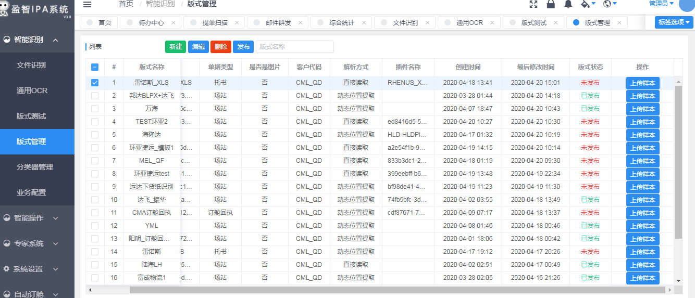
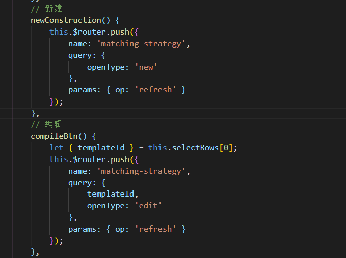
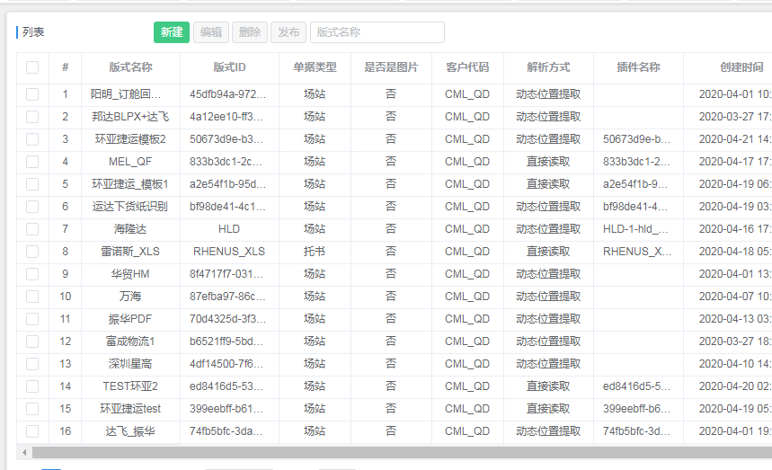
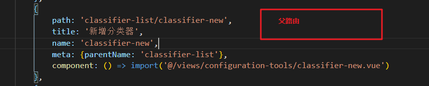
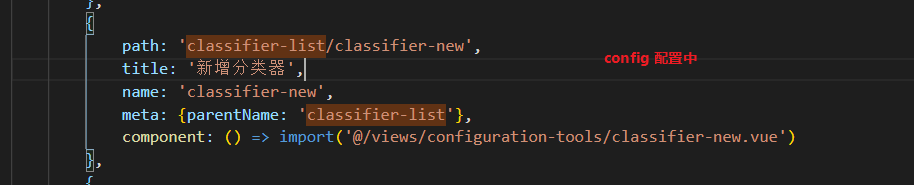
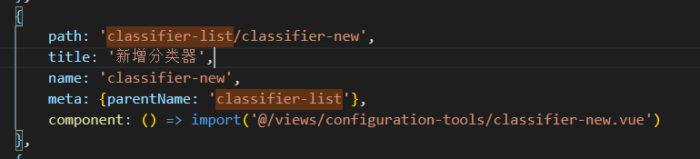
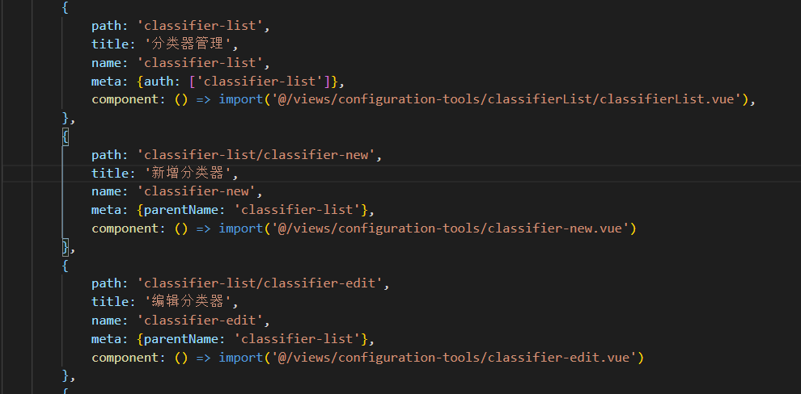

## 提示

> 场景 ， 点击button 弹出是否确认框

简单方法：

​		点击按钮时触发事件

``` js
this.$Modal.confirm({
                content: '<p>内容</p>',
                onOk: () => {
                    成功的回调
                    this.$Message.info('已取消发送邮件');
                    });
                },
                onCancel: () => {
                    this.$Message.info('已取消发送邮件');
                }
```


## element ui table 新写法



``` vue
<tepmlate>
	<el-table
    :data='templateDataTable.list'
    @select='selectTemplateRow'
    @select-all='selectAllTemplateRows'
    @row-click='onRowClick'
    @selection-change='onSelectionChange'
    border
    height='calc(89vh - 111px)'
    highlight-current-row
    oncontextmenu='return false;'
    ref='multipleTemplateTable'
    size='mini'
    sortable='custom'
    style='width: 100%'
>
    <el-table-column
        type='selection'
        width='36'
        fixed
    >
    </el-table-column>
    <el-table-column
        align='center'
        type='index'
        width='36'
        label='#'
        fixed
    >
    </el-table-column>
    <el-table-column
        v-for='item in templateDataTable.currentRender'
        :align="item.align || 'center'"
        :key='item.key'
        :label='item.title'
        :prop='item.key'
        :width="item.width"
        :show-overflow-tooltip='true'
        :fixed="item.key === 'templateName'">
        <template slot-scope="scope">
            <template v-if="item.key === 'templateStatus'">
                <span v-if="scope.row.templateStatus === 'PUBLISHED'"
                        style="color: #3DCCA6">已发布</span>
                <span v-if="scope.row.templateStatus === 'NOT_PUBLISH'"
                        style="color: #FF4C4C">未发布</span>
            </template>
            <template v-else>
                {{$util.tableRowFormat(scope.row, item)}}
            </template>
        </template>
    </el-table-column>
    <el-table-column
        align="center"
        width="120"
        label="操作"
        fixed="right">
        <template slot-scope="scope">
            <Upload
                :before-upload="(file)=>handleUpload(file, scope)"
                :action="''"
                :show-upload-list="false"
                type="select"
                accept=".zip"
                :format="['zip']"
                style="display: inline;">
                <Button
                    size="small"
                    :type="uploadArr.map(item=>item.templateId).includes(scope.row.id) ? 'success' : 'primary'">
                    上传样本
                </Button>
            </Upload>
        </template>
    </el-table-column>
</el-table>
</tepmlate>
```


``` js
templateDataTable: {
                pageNum: 1,
                size: this.$store.state.sysSettings.pageSize,
                pageOptionsList: this.$store.state.sysSettings.pageOptionsList,
                total: 0,
                currentRender: [
                    {
                        title: '版式名称',
                        key: 'templateName',
                        width: 110
                    },
                    // {
                    //     title: '分类器ID',
                    //     key: 'classifierId',
                    //     width: 100
                    // },
                    {
                        title: '版式ID',
                        key: 'templateId',
                        width: 110
                    },
                    {
                        title: '单据类型',
                        key: 'sheetType',
                        width: 80
                    },
                    {
                        title: '是否是图片', // 0:false 1:true
                        key: 'isImage',
                        width: 90
                    },
                    // {
                    //     title: '文件地址',
                    //     key: 'fileUrl',
                    //     width: 130
                    // },
                    {
                        title: '客户代码',
                        key: 'custCode',
                        width: 80
                    },
                    // {
                    //     title: '版式归属',
                    //     key: 'templateCust',
                    //     width: 80
                    // },
                    {
                        title: '解析方式',
                        key: 'parseApproach',
                        width: 100
                    },
                    {
                        title: '插件名称',
                        key: 'pluginName',
                        width: 100
                    },
                    {
                        title: '创建时间',
                        key: 'createTime',
                        width: 130,
                        type: 'datetime'
                    },
                    {
                        title: '最后修改时间',
                        key: 'lastModifiedTime',
                        width: 130,
                        type: 'datetime'
                    },
                    {
                        title: '版式状态',
                        key: 'templateStatus',
                        width: 80,
                        ChargedAffaires
                        charged-affaires
                        type: 'format',
                        format: {
                            'PUBLISHED': '已发布',
                            'NOT_PUBLISH': '未发布'
                        }
                    }
                    // {
                    //     title: '备注',
                    //     key: 'remarks',
                    //     width: 150
                    // }
                ], // 最终要渲染的表格 表头
                list: []
            }
```


## 编辑和新建同一个路由






``` js
{
            path: 'matching-strategy',
            title: { i18n: 'statistics.matchingStrategy' }, // '识别规则配置',
            name: 'matching-strategy',
            meta: {parentName: 'format-list'},
            component: () => import('@/views/configuration-tools/matching-strategy.vue'),
        }
```

classifier-new


matching-strategy









``` js
// api/scan.js 修改
export function delData(id) {
    return axios({
        method: 'delete',
        url: '/api/expert_scan_record/' + id
    });
}
```


``` js

```


fuzujian




## 组件中一个方法 ， 如何自定义多添加参数

带有返回值的默认函数，比如select组件的远程方法，不可以直接在方法中写参数的，可以借助匿名函数

``` js
// 组件
<Select
        v-model.trim="entitySearchValue"
        clearable
        filterable
        placeholder="请输入名称"
        :remote-method="v=>{entityNameSearch(v,'param')}"
      >
</Select>


// method
entityNameSearch(value,param){
    console.log(value);
    console.log(param);
}
```


+ 修改刷新按钮刷新整个页面
+ 修改edoc弹窗table高度
+ 修改 从edoc文件中读取  按钮    隐藏
+ 修改 必填字段中下拉框大小
+ 新建edoc文件保存成功后  清空数据
+ 修改单证代码最大输入长度为1
+ 修复编辑不同orderNo 页面数据不刷新bug
+ 优化 货物 集装箱 单证 删除按钮
+ 优化必填字段  可以清空 


+ 黄色底框 没有的字段
  + 三个 10位海关代码
  + 四个 企业名称
  + 离境口岸


## vue 跳转页面刷新页面

+ 清空数据`Object.assign(this.$data, this.$options.data.call(this))`

+ 路由导航守卫


### 跳转路由带参数

``` js
this.$router.push({
    path:
        '/intelligent-recognition/wisdom-customs-declaration/customs-declaration-edit',
    query: { id },
    params: { op: 'refresh' }
});
```


## 连续表单验证 ， 使用promiss数组

``` js
            // let good = new Promise((resolve, reject) => {
            //     this.$refs['goodsRef'].$refs['form'].validate(valid => {
            //         if (valid) resolve();
            //     });
            // });
            // Promise.all([top, good]).then(() => {
            //     this.$Message.success('验证通过,提交表单');
            // });
```


## 前端页面分割 vue-splitpane

``` vue
<template>
  <div>
    <split-pane v-on:resize="resize" :min-percent='20' :default-percent='30' split="vertical">
      <template slot="paneL">
        A
      </template>
      <template slot="paneR">
        B
      </template>
    </split-pane>
  </div>
</template>
```


## encodeURIComponent,encodeURI的使用以及在vue中用url传值的两种方式

> 一、问题发生场景
>
> 在vue中使用$route的query传值方式会发现值被转为一串不易读的字符，但是不影响从query参数中获取正确的原始的传值，这本来并没有引起我的注意。后来产品提了一个需求是某个页面必须在新标签页打开，搜了下vue好像没有提供这种方法，但是用window.open('#/urlxxx?fdn=' + fdn + '&page=interface')
>
> 可以满足需求，只是期间遇到问题：
>
> 因为$route.query已经帮我们自动编码了，我们平时使用时只需要写参数和值就好，在这里我就失去了警惕，直接写上了键值对，结果vue route进行跳转时url出错url的参数会自动抹掉结果跳转在只有‘？’符号前的路径的页面。把参数值使用encodeURIComponent编码后就可以解决这个问题了。
>
> 二、引出两个知识点
>
> 1，vue中使用$route的query传的值会被自动通过encodeURIComponent转码，也就是显示在浏览器地址栏里那串不易读的字符。同样的在vue里使用$route的query取值也会自动解码。断定是encodeURIComponent而不是encodeURI的原因是我传的值里有“/”而实际地址栏里没有。
>
> 但是在vue中使用window.open()来实现url在新标签页打开传值取值时需要手动转码（当出现不合规范的字符时）。
>
> 2, vue为什么要自动进行编码呢？转义是为了符合url的规范，在标准的url规范中中文和很多的字符是不允许出现在url中的。如果我们的键值字符串中包含'&?='，服务端就无法准确解析我们的键值对了。
>
> 补充一下encodeURI/decodeURI和encodeURIComponent/decodeURIComponent的区别：
>
> 前者被设计来用于对完整URL进行URL Encode，于是URL中的功能字符，比如&, ?, /, =等等这些并不会被转义；而后者被设计来对一个URL中的值进行转义，会把这些功能字符也进行转义。
>
> encodeURI: 不编码的符号是： A-Z a-z 0-9 ; , / ? : @ & = + $ - _ . ! ~ * ' ( )
> encodeURIComponent: 不编码的符号是：A-Z a-z 0-9 - _ . ! ~ * ' ( )
> ————————————————
> 版权声明：本文为CSDN博主「_wanwan5856」的原创文章，遵循CC 4.0 BY-SA版权协议，转载请附上原文出处链接及本声明。
> 原文链接：https://blog.csdn.net/wanwan5856/article/details/79616949

``` js
api.uploadCustomsFile(body).then(({ data }) => {
    if (data.returnCode === 200) {
        console.log(data,'pdf data');

        this.filePath = data.returnData.filePath;
        let otherFile = data.returnData['filePathList'];
        this.originalFilePath = data.returnData.originalFilePath;
        let filePath = data.returnData.filePath.split(/[/]|[\\]/);
        this.fileUrl =
            axios.defaults.baseURL +
            '/api/data/file/download/classifier/' +
            encodeURIComponent(filePath[filePath.length - 1]);
        if (otherFile && otherFile.length > 0) {
            otherFile.forEach(x => {
                let file = x.split(/[/]|[\\]/);
                this.otherFileList.push({
                    url:
                    axios.defaults.baseURL +
                    '/api/data/file/download/classifier/' +
                    encodeURIComponent(file[file.length - 1]),
                    title: file[file.length - 1],
                    filePath: x,
                    originalFilePath: x
                });
            });
            window.loggerD('this.otherFileList', this.otherFileList);
        }
        // 页面填写
        let oldData = _.cloneDeep(this.inputData);
        window.loggerD('oldData', oldData);
        let decOcrResult = data.returnData['decOcrResult'];
        if (decOcrResult) {
            let decHead = decOcrResult['decHead'];
            if (decHead) {
                this.inputData = decHead;
                this.inputData.id = oldData.id;
                this.inputData.orderNo = oldData.orderNo;
            }
            let decGoodsList = decOcrResult['decGoodsList'];
            window.loggerD('decGoodsList', decGoodsList);
            if (decGoodsList && decGoodsList.length > 0) {
                this.defaultGoodsList = decGoodsList;
            }
        }
    }
});
```


## 如何在el-table 列的表头中 加入红色的 * 号

``` vue
                    <el-table-column
                        :render-header="renderHeader"
                        align="center"
                        width="120"
                        :label="this.$t('declarationGoods.codeTs')"
                    >
                        <template slot-scope="scope">
                            <FormItem
                                :prop="'list.' + scope.$index + '.codeTs'"
                                :rules="tableData.rules.codeTs"
                            >
                                <i-input
                                    required
                                    size="small"
                                    v-model="scope.row.codeTs"
                                ></i-input>
                            </FormItem>
                        </template>
                    </el-table-column>
```


``` js
        // 表头标题加红色 * 号
        renderHeader(cerateElement, { column }) {
            return cerateElement('div', [
                cerateElement('span', column.label),
                cerateElement('span', {
                    domProps: {
                        innerHTML: '*'
                    },
                    style: {
                        color: 'red',
                        fontSize: '16px',
                        marginLeft: '5px'
                    }
                })
            ]);
        },
```


## 如何在el-table 中 添加对input框的表单验证


``` vue
<Form :model="tableData" :rules="tableData.rules" ref="form">
    <el-table
        @selection-change="selectionChange"
        :data="tableData.list"
        border
        height="calc(25vh)"
        highlight-current-row
        size="mini"
        style="width: 100%;marginTop:10px"
        fit
    >
<el-table-column
    align="center"
    :render-header="renderHeader"
    :label="this.$t('declarationContainer.goodsNo')"
>
    <template slot-scope="scope">
        <FormItem
            :prop="'list.' + scope.$index + '.goodsNo'"
            :rules="tableData.rules.goodsNo"
        >
            <i-input
                required
                size="small"
                v-model="scope.row.goodsNo"
            ></i-input>
        </FormItem>
    </template>
</el-table-column>
<Form>
```


tableData:

``` js
            tableData: {
                columnList: [],
                list: [],
                total: 0,
                pageNum: 1,
                pageSize: this.$store.state.sysSettings.pageSize,
                pageOptionsList: this.$store.state.sysSettings.pageOptionsList,
                filterList: [],
                sortList: [],
                rules: {
                    containerId: [
                        {
                            required: true,
                            message: '必填字段',
                            trigger: 'blur'
                        }
                    ],
                    containerMd: [
                        {
                            required: true,
                            message: '必填字段',
                            trigger: 'blur'
                        }
                    ],
                    goodsNo: [
                        {
                            required: true,
                            message: '必填字段',
                            trigger: 'blur'
                        }
                    ]
                }
            }
```


## vue 中 使用 ref传值

``` js
1.父组件中点击按钮吊起子组件模态框dialog进行内容设置，并给子组件传递id

this.$nextTick(() => {  此函数执行时所有的DOM挂载和渲染都已完成
      this.$refs.dialogRef.init(this.fatherId);  获取子组件中init方法并将父组件id传递给子组件
 });
```


``` js
2.在子组件中需接收父组件传来的内容id并查询内容详情

init (val) {
      this.activityId = val   接收父组件传递的id值
}
```


``` js
3.在子组件dialog中可以编辑内容，然后将数据通过$emit传递给父组件

this.$emit("setActivityBtn", this.SetForm);   setActivityBtn为父组件接收的方法，将参数传给父组件
```


``` js
4.父组件接收数据后提交到服务器
 setActivityBtn(data) { 获取子组件传来的值
     let params = data
 },
```


`子组件获取父组件的值可以用 this.$parent.data/method`


子组件中 ， 可以通过数组的方式向父组件传值

``` js
 this.$emit("setActivityBtn", [this.SetForm,this.dialogFormVisible]);  
```


子组件接收父组件的值 ， 可以直接赋值到data中的属性上

``` js
<template>
    <add-cart-pop   @confirmAddCart="addCart"
                    :sonName="fatherName"
                    :sonSalePrice="fatherSalePrice">
    </add-cart-pop>
</template>

<script>
     this.fatherName= this.detailData.name;
     this.fatherSalePrice= this.detailData.salePrice;
</script>
```


``` js
<script>
  export default {
       props: {
            sonName: {
                type:String,
                default:''
            },
            sonSalePrice: {
                type:Number,
                default:0
            },
        },
        data:function () {
            return {
                cartName:this.sonName,
                cartSalePrice:this.sonSalePrice
            }
        },
        methods: {
            addCart() {
                this.$emit('confirmAddCart',[this.cartName,this.cartSalePrice]);
            }
        }
  }
</script>
```

