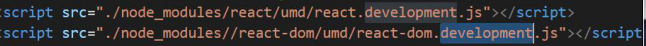
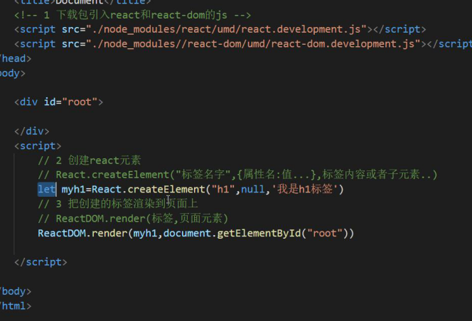
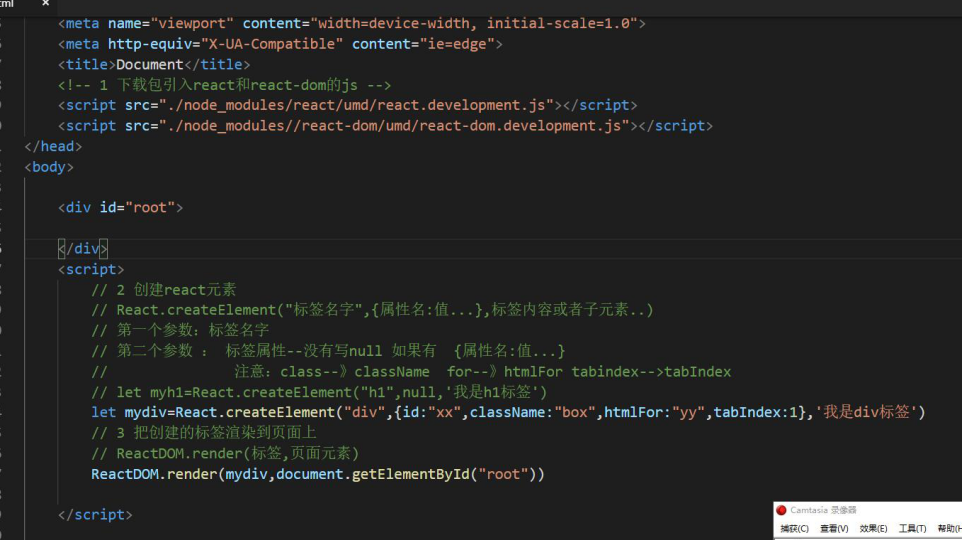
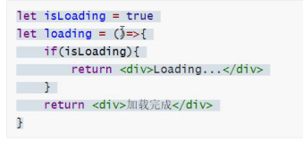
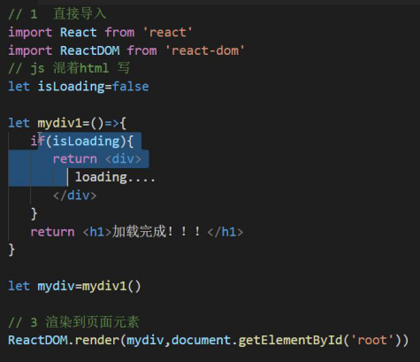

# React

## react的基本使用

### 安装

``` bash
npm i react react-dom -S
```

### 最原始的使用（引入js）

1. 下载包引入react和react-dom的js

   

2. 创建react元素

   ``` js
   let a = React.createElement('h1',null,'我是h1标签')
   ```

3. 吧创建的标签渲染到页面上

   ``` js
   ReactDOM.render(a,document.getElementById('root')
   ```

   

   

   > react.createElement(元素，键值对，内容1，内容2) 第三个属性之后需要在添加节点

1. 创建脚手架

   ``` bash
   npx create-react-app react01
   // vue 中 必需先下载包 再创建 项目
   ```

2. 启动 ： 

   ``` bash 
   npm strat
   ```

3. 将src目录下都删完，再创建index

4. index中

   ``` html
   //导入包
   import React form 'react'
   import ReactDOM form 'react-dom'
   
   //创建元素
   let a = React.createElement('h1',null,'我是h1')
   
   //渲染
   ReactDOM.render(a,document.getElementById('root'))
   ```

## JSX

+ JSX是javaScript XML 的简写

+ 为什么可以这么写？ 
  脚手架自带了Webpack帮我们转换

+ 针对创建React元素

  直接正常写代码

  ``` html
  a = <div>123</div>
  ```

  ``` react
  import React from 'react'
  import ReactDOM from 'react-dom'
  
  
  let myName = '宫彦祖'
  let a =(
      <div className='abc'>
          <h1>
              hello word
              
          </h1>
          <p>
              {myName}
          </p> 
      </div>
  ) 
  
  ReactDOM.render(a,document.getElementById('root'))
  ```

  

> 注意点：
>
> 1. 第一个元素换行要小心 ， 也就是a =<div></div>的时候，以后可以用（）包裹`a = （）` `内容包裹起来`
> 2. {  } 内不能写 if for while 等语句
>    `可以写 运算、三元运算`
> 3. React 没有v-if之类的指令

## 条件渲染if





``` react
import React from 'react'
import ReactDOM from 'react-dom'
 
let isloading = false
let a = () => {
    return isloading ? <div>Loading....</div> : <div>加载完成</div>
}

ReactDOM.render(a(),document.getElementById('root'))
```

## 