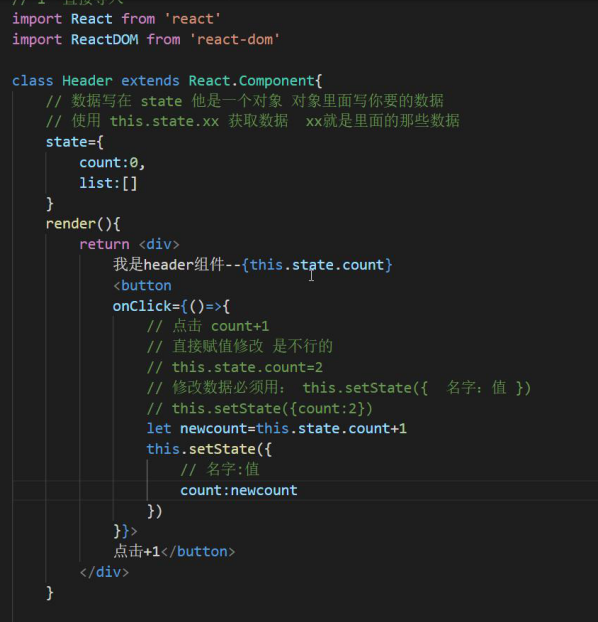
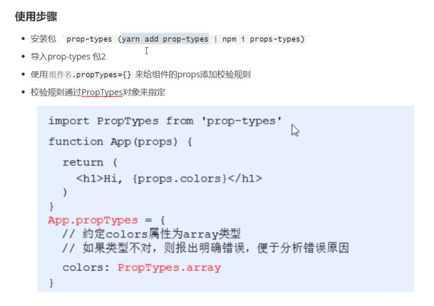
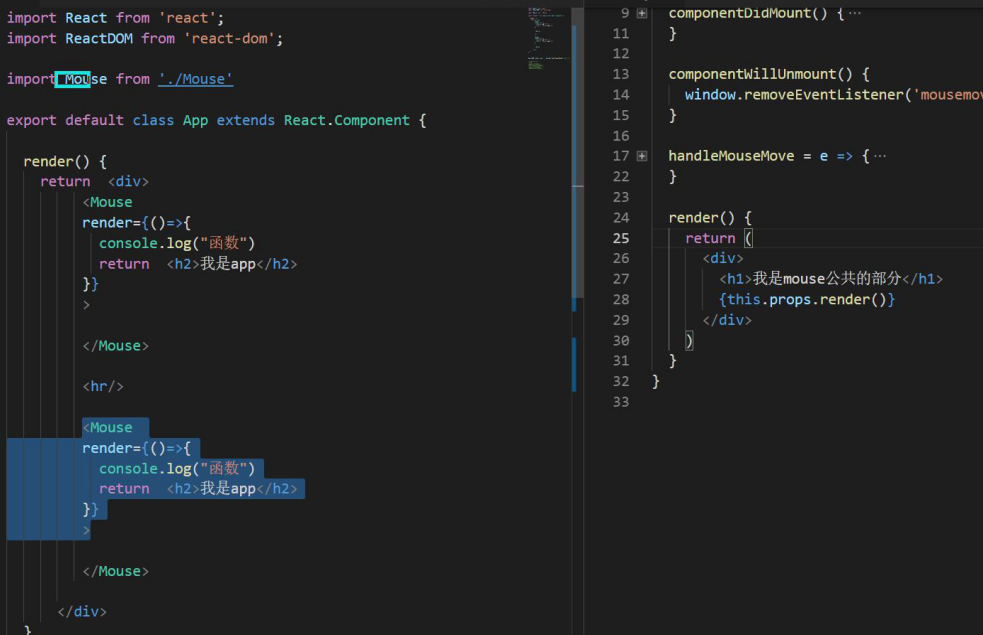
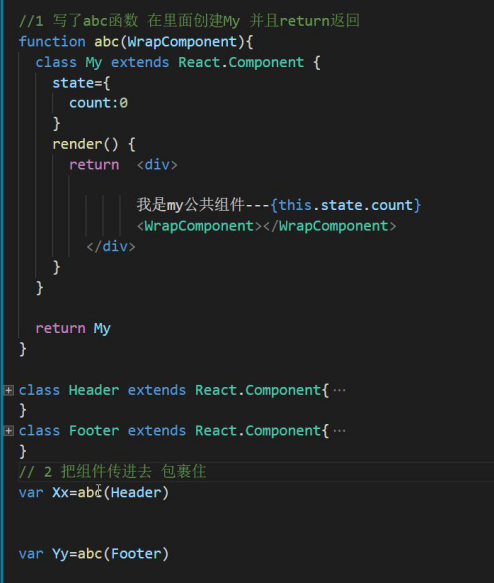

# React

## react的基本使用

### 安装

``` bash
npm i react react-dom -S
```

### 最原始的使用（引入js）

1. 下载包引入react和react-dom的js

   

2. 创建react元素

   ``` js
   let a = React.createElement('h1',null,'我是h1标签')
   ```

3. 吧创建的标签渲染到页面上

   ``` js
   ReactDOM.render(a,document.getElementById('root')
   ```

   

   

   > react.createElement(元素，键值对，内容1，内容2) 第三个属性之后需要在添加节点

1. 创建脚手架

   ``` bash
   npx create-react-app react01
   // vue 中 必需先下载包 再创建 项目
   ```

2. 启动 ： 

   ``` bash 
   npm strat
   ```

3. 将src目录下都删完，再创建index

4. index中

   ``` html
   //导入包
   import React form 'react'
   import ReactDOM form 'react-dom'
   
   //创建元素
   let a = React.createElement('h1',null,'我是h1')
   
   //渲染
   ReactDOM.render(a,document.getElementById('root'))
   ```

## JSX

+ JSX是javaScript XML 的简写

+ 为什么可以这么写？ 
  脚手架自带了Webpack帮我们转换

+ 针对创建React元素

  直接正常写代码

  ``` html
  a = <div>123</div>
  ```

  ``` react
  import React from 'react'
  import ReactDOM from 'react-dom'
  
  
  let myName = '宫彦祖'
  let a =(
      <div className='abc'>
          <h1>
              hello word
              
          </h1>
          <p>
              {myName}
          </p> 
      </div>
  ) 
  
  ReactDOM.render(a,document.getElementById('root'))
  ```

  

> 注意点：
>
> 1. 第一个元素换行要小心 ， 也就是a =<div></div>的时候，以后可以用（）包裹`a = （）` `内容包裹起来`
> 2. {  } 内不能写 if for while 等语句
>    `可以写 运算、三元运算`
> 3. React 没有v-if之类的指令

## 条件渲染if


``` react
import React from 'react'
import ReactDOM from 'react-dom'
 
let isloading = false
let a = () => {
    return isloading ? <div>Loading....</div> : <div>加载完成</div>
}

ReactDOM.render(a(),document.getElementById('root'))
```

## 数组map

+ 原生用法


+ React 用法


``` react 
let arr = [
    { name: '小米', id: 1 },
    { name: '华为', id: 2 }
]

let a = (
    <ul>
        {
            arr.map((item,index)=> {
            return <li key={item.id}>{item.name}</li>
            })
            //代码简化
            arr.map(item => <li key={item.id}>{item.name}</li>)
        }
    </ul>
)
```

> `注意：只要要写js了，就要用{}包起来`

## React的样式

1. 行内样式

   ``` react
   let a = <div style={{color:'red',background:'balck'}}></div>
   ```

   `两个{}代表js中写对象`

2. clssName

   ``` react
   //style 样式的写法
   //先导入
   import './index.css'
   
   let a = (
       <div className='box'>
           hello , word 
       </div>
   )
   ```

   + className = 'box'

## React 创建组件的两种方式

### 1.函数创建组件

要求：

1. `首字母必须大写`

2. `必须return`，没有的话可以`return null`
3. 使用函数组件当成`标签`使用就可以了，单标签也可以

``` react
import React from 'react'
import ReactDOM from 'react-dom'


function First (){
    return <div>hello word... </div>
}


ReactDOM.render(<First/>, document.getElementById('root'))
```

### 2. class 类组件

ES6 class 类的回忆：


继承：


稍微复杂的写法：

+ 这样会报错，需要在constructor中写一个`super()`


react 类组件正儿八经的：

在一个页面写：

``` react
class Abc extends React.Component{
    render(){
        return (
            <div>
                hello word 
            </div>
        )
    }
}
```

引入组件：

组件部分

``` react 
import React from 'react'

class Header extends React.Component{
    render(){
        return <div>hello world</div>
    }
}

export default Header
```

入口文件部分(index)

``` react 
import Header from './header/header'
```


注意：

`入口文件必须导入 react 和 react-dom`

## 事件绑定

示例：

``` react
//事件绑定
class Header extends React.Component{
    abc(event){
        console.log(153);
        
    }
    render(){
        return (
            <button onClick={this.abc}>点击</button>
        )
    }
}
```

注意：

`this.abc`后面不能加（） 否则没有点击直接调用

事件对象：

``` react
import React from 'react'
import ReactDOM from 'react-dom'

class Header extends React.Component {
    abc(e){
        console.log('事件对象',e);
        
    }
    render(){
        return (
            <button onClick={this.abc}>点击</button>
        )
    }
}

ReactDOM.render(<Header /> , document.getElementById('root'))
```


​		e.preventdeault()阻止默认行为

## 数据  state数据

state 就相当于Vue中的data

+ 无状态组件，没有操作state数据 函数组件
  + 只是单纯的显示
+ 有状态组件 操作state组件 类组件
  + 可以点击和发ajax
+ 数据写到state中
  + 使用，this.state.变量名

``` react 
class Header extends React.Component {
    state = {
        foo:'world'
    }
    render(){
        return (
            <div>
                hello {this.state.foo} 
            </div>
        )
    }
}
```

### 修改数据

+ 修改数据必须用 this.setState({ 变量：值 })

+ 不能直接赋值改修 



++ -- 案例：

``` react

```

this指向问题：

1. `箭头函数`


2. 第二种改法

   

3. 改变this指向 bind
   


### 复习：改变this 的指向

bind 改变this指向 并返回新函数

call 改变this指向  并执行函数

apply 改变this指向	并执行函数


## 受控表单变单元素板顶了state数据

实现了类似Vue中的v-modle效果


基本代码：

``` react
import React from 'react'
import ReactDOM from 'react'


class Foo extends React.Component{

    state = {
        value:''
    }
    getValue=(e)=>{
        this.setState({
            value:e.target.value
        })
    }
    render(){
        return (
            <input onChange={this.getValue} value={this.state.value}></input>
            <div>{this.state.value}</div>
        )
    }
}


ReactDOM.render(<Foo></Foo>,document.getElementById('root'))
```


## 扩展运算符

``` js
var a = [1,2,3]
var b = [4,5,6]
var c = [...a,...b] //1,2,3,4,5,6
```


## ref(了解)


代码实现：

``` react

```


## 子父兄传值

### 父用子组件：


### 父向子传值

1. 在需要传值的组件上面，写上属性
2. 在子组件直接使用this.props获取


### 子传父


代码：

​	注意：`想要渲染，需要用到componentDidUpdata(){}`

``` react
class Parent extends React.Component{
    state = {
        foo:'123'
    }
    add=(val)=>{
        this.setState({
            foo:val
        })
    }
    render(){
        return (
            <div>
                父组件
                {this.state.foo}
                <Son1 name={this.add}></Son1>
            </div>
        )
    }
} 

class Son1 extends React.Component{
    state={
        foo:'son1'
    }
    add=()=>{
        this.props.name(this.state.foo)
    }
    render(){
        
        return (
            <div>
                子组件
                <button onClick={this.add}>点击给父组件传值</button>
            </div>
        )
    }
}
```


### 兄弟传值

亲兄弟找父亲


``` react
class Parent extends React.Component{
    state = {
        foo:0
    }
    add=(val)=>{
        this.setState({
            foo:val
        })
    }
    render(){
        return (
            <div>  
                <Son1 value={this.state.foo}></Son1>
                <Son2 value={this.add}></Son2>
            </div>
        )
    }
}

class Son1 extends React.Component{
    state={
        foo:'son1'
    }
    render(){
        return (
            <div>
                Son1接收值：{this.props.value}
            </div>
        )
    }
}
class Son2 extends React.Component{
    state={
        foo:'Son2的值'
    }
    render(){
        return (
            <div>
                <button onClick={()=>{
                    this.props.value(this.state.foo)
                }}>点击</button>
            </div>  
        )
    }
}
```


表兄弟

redux相当于Vuex


### 爷孙传值


比较复杂


只要稍微复杂一点都是用的是redux


### 函数组件父传子


+ 这里不用this.props.name直接可以传值


### 父传子中，标签中间的内容

`this.props.children`获得


## props类型验证



1. ``` bash
   yarn add props-types
   ```

2. ``` react
   import PropsTypes from 'props-types'
   ```

3. 要验证组件 .propType={传的名字：验证规则}

   ``` react
   //在组件外面写
   组件.propTypes={
       name:PropTypes.string
   }
   ```

   

如果没有传prop值，则给一个默认的值

组件.defaultProps={名字：默认值}


## React生命周期


``` react
class Parent extends React.Component{
    //constructor 创建组件时最先执行
    /*
        作用：1. 初始化state
              2. 为事件处理程序绑定this
    */ 
    constructor(){
        super()
        this.state={
            count:0
        }
    }
    // 简化写法
	state={
        count:0
    }

    // render 每次渲染都会触发 `注意，不能调用setState()`
    render(){
        return (
            <div>
                {console.log('render')}
                <button 
                onClick={()=>{
                    var newCount = this.state.count - 1
                    this.setState({
                        count:newCount
                    })
                }}
                >-</button>
                {this.state.count}
                <button 
                onClick={()=>{
                    var newCount = this.state.count + 1
                    this.setState({
                        count:newCount
                    })
                }}
                >+</button>
            </div>
        )
    }


    //DOM渲染完成后
    /*
        作用：1. 发送Ajax请求
              2. DOM操作
    */
    componentDidMount(){
        console.log('componentDidMount');
        
    }


    // 组件更新后触发
    /*
        作用：1. 发送Ajax请求
              2. DOM操作
        `注意，要用setState（）必须放在一个if条件中`
    */
    componentDidUpdate(){
        console.log("componentDidUpdate");
        
    }


    // 卸载
    // 作用：清理定时器
    componentWillUnmount(){
        console.log('componentWillUnmount');
        
    }
}
```

不常用的：

+ 所有带will的
+ 
  + 可以用来控制组件是否要更新

+ 


## 组件复用

两种方式：

1. render props模式
2. 高阶组件（HOC）

### render props模式

步骤：

1. 给组件写一个render函数，然后return 内容

2. 子组件用this.props.render（） 接收



> `推荐使用标签内容的方式，然后用this.props.Children()的方式接收`


### 高阶组件（HOC）

把一个组件传入函数 函数里面用另外一个组件包裹住 返回

这样做 组件不仅自己有 还有包裹的那个公共部分




## setState（）说明

+ 是异步的
+ 多次修改相同的，值会执行一次，他会合并修改内容
+ `setState（{}，()=>{}）`，第二个参数拿到的数据是最行新的
+ 正常情况还是原来的修改方式，只有修改需要立刻拿到数据，才需要第二个回调函数

还有一个复杂语法，了解：ps(也是异步的)


## jsx语法的转化过程

+ jsx仅仅是React.createElement() 的语法糖
+ jsx 语法被 @babel/preset-react 插件编译 为 React.createElement() 帮助我们转化成浏览器认识的


## webpack 如何编译

+ 有一个文件叫 webpack.config.js  在Vue和React中被隐藏起来了，因为脚手架自带
+ wabpack.config.js
  + entry 入口
  + output 打包后的文件
  + loader 下载各种loader css-loader less-loader....
  + plugin 小插件


## 组件更新机制

补充：

​	html改变时，页面会重绘，重排

react的优化：


+ 一个组件数据变化  那么只有当前组件会变化，其他的不会变化


## 组件性能优化

### 减轻state

+ 只存储跟组件渲染相关的数据
+ 固定死的数据，可以不放在state中

两种写法：

1. 直接在外面定义 let name = “XXX”
2. 在组件中直接 name = “XXX” 调用用this.name


### 组件更新是否渲染


+ 继承改变
+ 缺点：只能进行简单比对，数组就不能比对

+ 也就是复杂数据类型就不能用这个了，只有简单类型可以使用
+ 简单类型：Number string true of false undefined
+ 复杂类型：Array Object


## 虚拟DOM和Diff算法

为什么会有虚拟DOM：

​	如果每次修改数据，会更新组件的全部内容  性能是很差的


本质：js对象


### diff算法，找不同

把新生成的虚拟的DOM 和原来的DOM对比，如果有不同的地方，他会找到真实DOM那个位置修改


+ 先比较组件是否有变化  如果变化直接修改 如果没有变化就继续进入组件内部、
+ 再去比较外层节点元素 如果变化 就 更新 没有变化 继续进入
+ 比较最里面 如果变化 更新 没有变化 就不更新
  +  这也解释了 为什么要加上key
  + 加 key 就会更新组件


## React路由

1. ``` bash
   yarn react-router-dom
   ```

2. 导入：
   import Router from 'react-router-dom'


### 路由的原理


#### hash模式


#### history 模式

不带#的，的地址，叫`history 模式`


### React,Vue，两种模式都可以用


+ 改变包裹，即可改变模式
+ React 一般用history模式，打包后需要传到服务器才正常
+ hash 模式，打包后 即使没有传到服务器也正常

两者监听函数不同：

​	


## 声明式导航

直接写link或者a链接

``` html
<link to="/home">去home页面</link>
```


## 编程式导航

使用js来跳转


## 默认地址匹配


exact是精确匹配路径，否则就是模糊匹配，只要前面相似，都会匹配


## 路由参数


传参 在path路径后/:id 

### 如何拿到这个值呢:

​	在componentDidMount里

`this.props.math.params.id`

``` react
//入口文件
import React from 'react'
import ReactDOM from 'react-dom'

import App from './app.js'

ReactDOM.render(<App />, document.getElementById('root'))
```


``` react
//app组件中
import React from 'react'

import {BrowserRouter as Router , Route , Link} from 'react-router-dom'

import Login from './components/login'
import Detail from './components/detail'

export default class App extends React.Component{
    render(){
        return (
            <Router>
                根组件
                <Route exact path="/login" component={Login}></Route>
                <Link to="/login">123</Link>
                <Route exact path='/detail/:id' component={Detail}></Route>
            </Router>
        )
    }   
}
```


``` react
//detail组件中
import React from 'react'
export default class Detail extends React.Component{
    render () {
        return (
            <div>详情页面</div>
        )
    }

    componentDidMount(){
        console.log("传来的id是",this.props.match.params.id);
    }
} 
```


## 嵌套路由

注意：

​	父路由就不能写exact 精确匹配了


## Switch（了解）


path相同，只显示第一个


## 路由的跳转

### 重定向

重新跳转，redirect

``` react
import { Redirect } from 'react-router-dom'
<Route
    exact
    path="/"
    render={
        ()=>{
            return <Redirect to="/login"></Redirect>
        }
    }
    >

</Route>
```


## 一个简单的跳转案例

效果：


点击下方tabbar栏可以跳转到子路由


实现：


入口文件：

``` react
import React from 'react'
import ReactDOM from 'react-dom'

import App from './app.js'

ReactDOM.render(<App />, document.getElementById('root'))
```


app.js文件：

``` react
import React from 'react'

import {BrowserRouter as Router , Route , Link , Redirect} from 'react-router-dom'

import Home from './components/home'

export default class App extends React.Component{
    render(){
        return (
            <Router>
                <Route
                    exact
                    path="/"
                    render={
                        ()=>{
                            return <Redirect to="/home"></Redirect>
                        }
                    }
                ></Route>
                <Route path="/home" component={Home}></Route>
            </Router>
        )
    }   
}
```


home 组件：

``` react
import React from 'react'
import { Route , Link } from 'react-router-dom'
import '../css/home.css'
import News from '../components/news'
import My from '../components/my'
export default class Home extends React.Component{
    render () {
        return (
            <div className="a">
                <Route path="/home/news" component={News}></Route>
                <Route path="/home/my" component={My}></Route>
                <div className='tabbar'>
                    <Link className="news" to="/home/news">
                        新闻
                    </Link>
                    <div className="my" onClick={()=>{
                        this.props.history.push('/home/my')
                    }}>
                        我的
                    </div>
                </div>
            </div>
            
        )
    }
}
```

+ 跳转的方式可以用Link 或者 点击事件完成
+ component 文件夹 方式


# 项目

## 技术栈


## 启动


下载的包：

