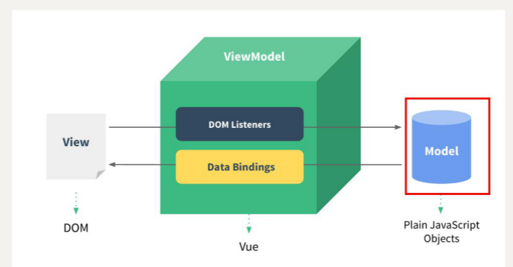
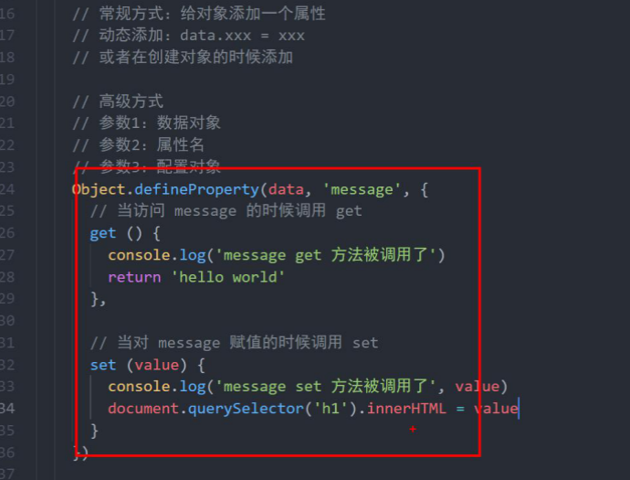
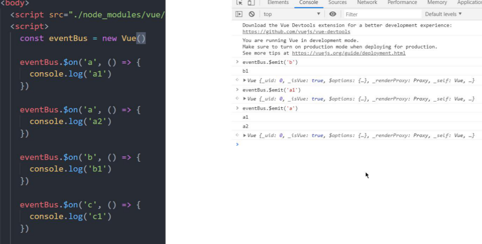
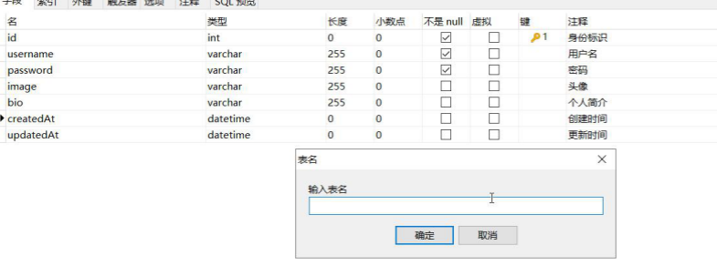
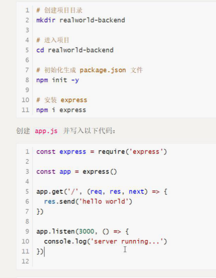
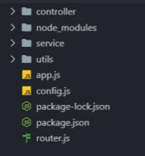
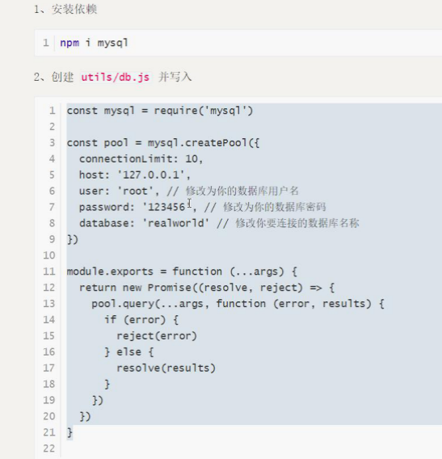

# Vue数据绑定原理

## 介绍

修改视图的方法

+ 直接操作DOM
+ 数据驱动视图方式
  + 微软的一个技术：WPF
  + 前端框架Angular.js 是第一个把MVVM带入了前端（x时代，2.x 时代）、
  + React
    + 数据驱动视图
    + 组件化
  + Vue.js
  + 微信小程序 也是数据驱动视图


+ MVVM
  + M  普通jS对象
  + V  views 视图
  + VM 视图模型

  原理

  


属性配置

​	.....


## proxy语法

``` js
new proxy(data , {
    get (){},
    set (){}
})
```


eventBus




## 事件发布 / 订阅模式

EvebtBus 原理的实现


# Vue全栈式 项目

## 后台

+ 请求路径 /login
+ 请求参数 用户名、邮箱、密码-
+ 完成功能
+ 返回数据 注册成功与否
+ 请求方式 POST


## 数据库的设计

### 表的创建

#### 用户表



+ 创建express目录



+ 用 node 启动服务 
+ 方便修改 用 nodemon


#### 后端目录的创建

+ 



#### 数据库集成




#### 后台解决跨域 CORS

+ 跨域资源共享

两种请求

+ 简单请求
+ 非简单请求

简单：


``` bash
npm i cors
```

``` js
const cors = require('cors')
app.use(cors({
    origin: '*'  // 都可以请求
    origin: 'http://xxx.xxx.xxx'  // 指定网页
    
}))
```

推荐阅读：[ 阮一峰，或者mdn](http://www.ruanyifeng.com/blog/2016/04/cors.html)


#### 配置解析body参数

在 `app.js`中新增

``` js
app.use（express.json（））
```


#### 获取客户端参数

Body参数：

``` js
req.body
```

query参数：

``` js
req.query
```

路径参数：

``` js
req.params
```

Header参数：

``` js
req.headers
```

