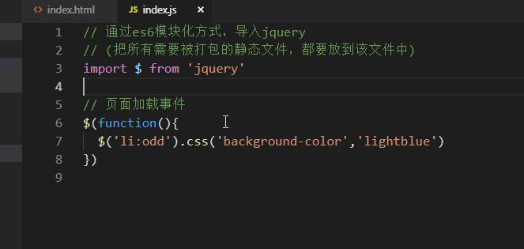
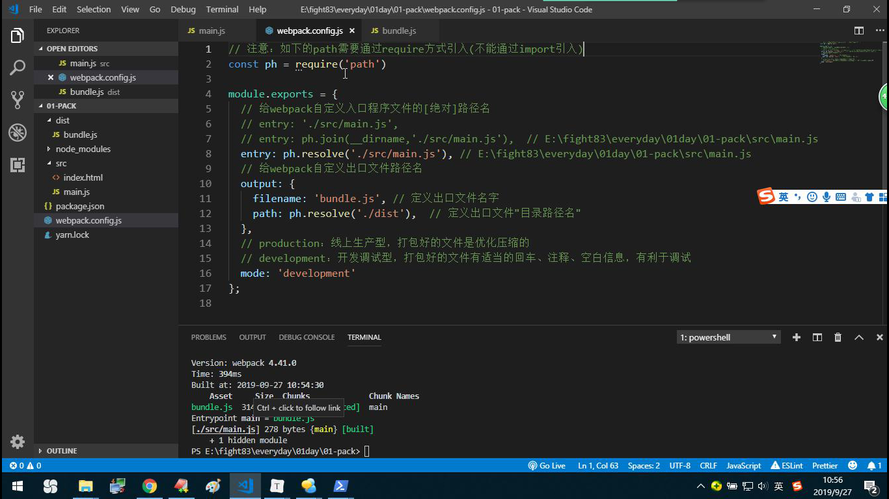
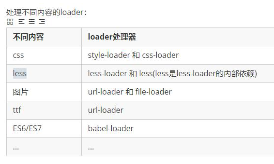
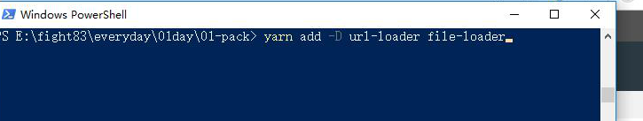
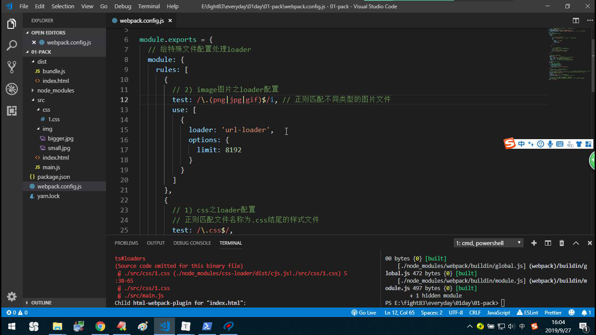
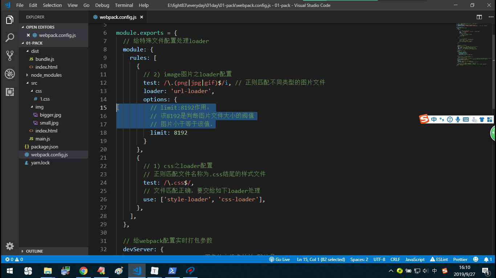
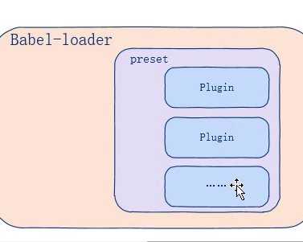

# WebPack

## 什么是Webpack

+ 通过Node.js开发出来的

+ 模块`打包`机器
+ 比如 less es6、7 、Vue、img 、ttf 一次性将他们打包为合适的格式，以供所有浏览器使用（`转码、降级处理`）
+ 模块化开发
+ 对img图片进行字符串转换处理

## 什么地方适合使用WebPack

+ SPA （single program application） 单页面应用项目
+ cms等复杂、多页面系统不适合通过webpack开发

## yarn

### yarn：js包管理工具

+ yarn 安装

``` bash
npm i -g yarn   // 全局方式安装yarn依赖包
yarn config set registry https://registry.npm.taobao.org  // 配置为taobao镜像
```

> yarn  --version    // 查看yarn版本
>
> yarn config get registry  // 查看确认镜像是否正确

+ yarn 依赖包管理

``` bash
yarn  add  包  // 装包  npm i 包
yarn  remove 包 // 卸载 npm uninstall 包
yarn            // 给当前项目安装全部依赖包 npm i
yarn -y init   // 初始化package.json文件  npm -y init
yarn add -D 包 // 开发依赖方式装包  npm i -D 包
```

### 使用

``` bash
yarn -y init
```

``` bash
yarn add jquery
```



### 原理：

​	webpack 会寻找src/index.js文件 本身包括两部分内容  编译处理  吧结果输出到 dist/main.js中


## 安装配置

[webpack官网]{webpack.docschina.org}


## 配置打包模式



1. 自行吧入口文件名字和出口修改 也可以修改dist文件夹名字  


## 删除distwe文件目录下的无用

1. 安装依赖包 web-cleanup-plugin
2. 在webpack。config。js中做如下配置

``` bash
//
```

3. 现在再次打包 就会发现无用的文件被清除


## loader（css）-应用css文件



+ loader 是一个加载器
+ 是webpack 是变异处理不同类型问价你的工具 本质是函数
+ css less img es67

步骤：


1. 依赖包


## loder（url、file）







file 把符合添加条件的图片  大于8192b  

file 把符合添加条件的图片  小于8192b  

该阀值建议大小10k左右   负责打图片 转化成字符串打鱼10b的loi

 base64 格式字符集成到打包工具  他不会调用http模块

+ outputPath 本事 file-loader 的属性  但是如果是大图片的话，url-loder会调用file-loder的属性，所以可以使用


# 插件：plugin  

+ html-webpack-plugin 编译打包模板文件
+ 删除目录dist中无用的打包文件

# 实时打包

//装包  yarn add -D webpack-dev-serrver

// 配置 webpack.config.js  devserver : {port host open compress}

// 打包指令 pafckage。json

// 实时打包 npm run serve


# loader（es6）-应用高级语法

+ 直接物理打包 是不会做降级处理的 低版本不兼容

## babel-loader 

webpack不干活 



+ 不同类型的es6  高级语法降级处理 都有独立的工具做编译转化  叫 plugin
+ preset 是常用的 plugin 的集合

