# Vue基本语法和概念

## 什么是Vue.js

+ 是最火的一个前端框架，React是最流行的一个前端框架（Web，手机app也可以开发 vue需要借助Weex）
+ 三大前端主流框架：Angular.js  React.js Vue.js
+ Vue.js 是一套构建用户界面的框架 `只关注视图层` 便于与第三方库或者既有项目整合
+ 前端工作 主要负责MVC中的V这一层  和界面打交道 来制作页面效果

## 为什么学习流行框架

提高开发效率的发展历程：

原生js => jQuery => 模板引擎 => angular => vue

不再操作DOM元素  更多时间去关注业务逻辑

## 框架和库的区别

+ 框架是一套完整的解决方案，对项目侵入性较大 如果需要更换框架 需要重新构架整个项目
+ 库（插件）：提供某一个小功能，对项目侵入性较小，很容易切换库

## MVC 与MVVM

+ mvc 是后端分层开发概念


+ MVVM 是前端视图层的概念 主要关注与视图层分离 也就是说 MVVM把 前端的视图层分为了三个部分 Model，view ， vm ViewModel

## Vue 三种安装方式

1. 采用本地的文件引入
2. 采用现在cdn引入的方式 需要花钱 线上
3. npm 安装 （项目用这个，现阶段教学用本地）

## 为什么要在body结尾处加载script

1. html渲染顺序是从上到下，如果遇到script 标签  会停止渲染 先去解析 解析完成之后在渲染 如果js包非常大  会造成页面渲染卡顿  会出现瞬间白屏

## Vue特点：

1. 数据驱动视图 可以让我们只关注数据 完全`解耦`**数据** 和 **视图** => 响应式数据 => 数据变化=> 视图一定变化
2. MVVM双向绑定 改变视图 或者改变数据 另外一个自动改变
3. 适应当前`SPA`的项目开发single page application

## vue初体验：

### 五个步骤：

``` html
// 1. 设置Vue 管理的视图

<div id="app" class='app'>
    // 5. 在管理视图中 用{{}}使用data中数据
    {{name}}
    <p style=“color:red”>{{title}}</p>
</div>
// 2. 引入vue.js
	script src
<script>
// 3. 实例化一个对象
    var vm = new Vue({
        el:'#app',  // 4. 设置Vue实例的选项 将视图和vue关联
        el:'.app'  //class选择器也可以 不过只能对应一个视图 class也就没有意义 用id就好
        el:docment.getElementById('app') // dom 元素也可以
        data:{	//
            name:'hello world'，
            title:'任性'
        }
    })
</script>
```

### el选项：

+ 指定Vue实例所管理的html视图

+ el一旦确定不再改变
+ el不能挂载在body 和 html 标签上

### data选项：

+ 数据变化 => 视图变化
+ 可以通过 vm.$data.name 拿到值 等于号可以重新赋值  或者 **vm.name = ''** 赋值
+ 视图绑定的数据 必须在data中声明

### methods：

+ 方法中的this 自动绑定vue实例 this.name
+ 是一个对象
+ 可以直接通过vm实例访问方法  或者 在插值表达式中使用
+ 可以通过 vm.调用带data中所有的属性
+ 可以通过vm. 调用带methods 所有的方法
+ 所以 在data中命名中  不能喝methods中的方法重名
+ 懒人写法 fn3（）{   }  等价于 fn3： function (){}
+ methods中不能用箭头函数 this绑定父级作用域

## 插值表达式：


## 指令：

+ v- 前缀  Directives  v- 后面预期值是`单个Javascript 表达式` （v-for 是例外）

### v-text:

``` html
//插值表达式
<p v-text='name'></P>
<p v-text='name + 1'></P>
<p v-text='name +'真棒''></P>


var nm = new Vue({
	el:'#app',
	data:{
		name:'张三'，
		
},
	methods:{

}
})
```


### v-html 和 v-text:

+ v-text 会覆盖标签里面所有的内容
  + 而差值表达式则是更新标签中局部的内容
+ 相当于inner-html 和 inner-text
+ `尽量少使用html （xss攻击）`

### v-if 和 v-show（条件渲染）:


+ v-show 会渲染标签，只不过在样式中加入一个 display：none；

+ v-if 直接决定元素的添加或者删除

+ 如果需要频繁的切换 则使用v-show 

  else 则用v-if  这个用的多


+ `如果不想要div 可以吧div标签换成 template`,这个方法v-show不好使
+ 这里会定义一个showmessages属性 值为布尔值 来控制元素的显示隐藏
+ 如果 要显示隐藏 则在控制台 输入 vm.showmessages=false
+ v-if 有更高的切换开销  v-show 有更高的初始渲染

### v-on绑定事件：

+ 使用方法：v-on:事件名.修饰符='方法'  或者用@代替v-on：
+ `修饰词` .once只触发一次 .prenent 调用 event.preventDefault()

案例：点击出现和消失


+ v-on：cilck 等价于 `@click`
+ 事件传参
  + 匿名传参：如果 只写方法名  那么调用方法中会有一个默认参数  就是 `event`
  + 显示传参：如果传入参数 ， 同时也想用event 那么在指令中`fn（$event , 1）{    }` 否则直接写就会 报错underfined
  + 方法写不写括号是有区别的！！

+ 案例：

两个事件：

	1. onchange   失去光标改变
   	2. oninput   随时改变

 	3. 如何获取value `e.target.value`

### v-for：数组与对象用法不同

#### 数组：

+ 循环谁，指令在谁身上 而不是其父级元素  就是要生成谁
+ 根据一组数组或者对象的选项进行渲染
+ `v-for`需要`item in items`特殊的语法   或者将 in 换成 of
+ `items`是源数组或者对象
+ `(item,index) in items`   遍历 及 索引

案例：


案例中注意：

+ .split( '' ) 结果 是把数组拆分
+ reverse（） 把数组颠倒
+ join（''） 数组合并

#### 对象：

语法：

``` js
item in items  // item为当前遍历属性对象的值
(item, key, index) in  items //item为当前遍历属性对象的值 key为当前属性名的值  index为当前索引的值
```


### v-for key：

+ 使用  ： 通常给列表数据中的唯一值 也可以用索引值
+ `:key='index'`
+ `v-for(item , key , index ) in items`

案例：


### v-if 和 v-for相遇

+ v-for 的 优先级 大于v-if


``` js
<body>
    <div id="app">
        <p v-if="item>10" v-for="(item,key,index) in list" :key='index'>{{item}}</p>
    </div>
    <script src="./vue.js"></script>
    <script>
        var vm = new Vue({
            el: '#app',
            data: {
                list:[1,5,6,8,55,88,99,20,4]
            },
            methods: {}
        });
    </script>
</body>
```

## 表格案例：

+ 如果想测试 arr.length === 0 的效果 可以在控制台输入 vm.arr=[];

## 第一天总结


## v-bind

+ `v-bind:id='ID'`
+ 简写 `<p :id="'ID'">  </p> ` // 不加引号为变量
+ 加引号和不加引号区别
+ 绑定一般属性的用法  <p v-bind:属性名='数据对象中的属性名'></p>>

### 案例：基本使用

``` js
//代码：
<body>
    <div id="app">

        <input type="text" value="666" v-bind:id='ID'></input>
        
    </div>
    <script src="../vue.js"></script>
    <script>
        var vm = new Vue({
            el: '#app',
            data: {
                ID: 'a',
                src: 'http://pic37.nipic.com/20140113/8800276_184927469000_2.png'
            },
            methods: {

            }
        });
    </script>
</body>
```

### 绑定class对象语法：

绑定clss的对象语法

案例：v-bind： 绑定 class 对象语法：

语法： ` b-bind：class=" clss类名 ： 布尔值 "`//布尔值一般用data数据边量替换

+ 原来的class也会存在 新添加的class如果渲染有重复 那么将覆盖效果

``` html
	<style>
        .left {
            position: absolute;
            left: 0;
            color: brown;
        }

        .right {
            position: absolute;
            right: 0;
            color: #0f0;
        }

        .default {
            font-size: 40px;
            font-weight: bold;
        }
    </style>
</head>

<body>
    <div id="app">
        <!--   :class="{ class名称": 布尔值 }" -->
        <p :class="{left:showLeft,right:showRight}" class="default">
            9月13号放假去天安门
        </p>
    </div>
    <script src="../vue.js"></script>
    <script>
        var vm = new Vue({
            el: "#app",
            data: {
                showLeft: true,
                showRight: true
            },
            methods: {}
        });
    </script>
</body>
```


### 绑定class数组语法：

语法：`：class="[  class变量1 ， class变量2   ]"`

代码：

+ class变量1 可以写为 [{ class名 ： 代表布尔的变量 }]
+ 数组中加入单双引号 代表这是个 字符串 

``` html
<body>
    <!-- **`任务`**

        1. 实例化一个Vue实例
        2. 定义一个p标签 原有class 为default 
        3. 使用v-bind数组语法将class变为 default primary danger info
        
        **`路径`**参照实现代码 -->
    <div id="app">
        <p class="default" :class="[primary,'danger','info']">666</p>
    </div>
    <script src="../vue.js"></script>
    <script>
        var vm = new Vue({
            el: '#app',
            data: {
                primary: 'primary',
                danger: true,
                info: true
            },
            methods: {}
        });
    </script>
</body>
```


### 绑定 style对象语法

语法： ` v-bind：style="{  css属性：变量名  }"` 

案例：

+ 比如 font-size等 带 -  这个符号的  需要采用驼峰写法 把这个 - 去掉

``` html
<body>
    <div id="app">
        <p style="color:aqua" :style="{color:color , fontSize:fontsize ,fontWeight:fontwight}">Lisa:刀剑神域op</p>
    </div>
    <script src="./vue.js"></script>
    <script>
        //         **`任务`**

        // 1. 实例化一个Vue实例
        // 2. 定义一个p标签 原有样式 为字体红色
        // 3. 使用v-bind绑定对象语法 将字体大小设置为48px ,加粗
        var vm = new Vue({
            el: '#app',
            data: {
                color: 'red',
                fontsize: '48px',
                fontwight: 1000
            },
            methods: {

            }
        });
    </script>
</body>
```

### 绑定 style 数组 写法：

语法：  v-bind:style="[对象1，对象2]"      ：style="[ {color:red},{fontSize:'40px'} ]"   

代码：

+ 对象1 可以为data 数据

``` html
<body>
    <div id="app">
        <p :style="[a]" style="color:red">123456</p>
    </div>
    <script src="../vue.js"></script>
    <script>
        // ** `任务` **

        // 1. 实例化一个Vue实例
        // 2. 定义一个p标签 原有样式 为字体红色
        // 3. 使用v - bind绑定数组语法 将字体大小设置为48px, 加粗
        var vm = new Vue({
            el: '#app',
            data: {
                a: {
                    fontSize: '48px',
                    fontWeight: 1000,
                    color: "aqua"
                }
            },
            methods: {

            }
        });
    </script>
```


案例：控制style 中 字体大小

+ 所用到的 两个Number 方法 parseInt parseFloat   比如 48px  直接取48  如果是 px48 不行

``` html
<body>
    <div id="app">
        <button @click="big">变大</button>
        <button @click="sm">变小</button>
        <p :style="[a]" style="color:red">123456</p>
    </div>
    <script src="../vue.js"></script>
    <script>
        // ** `任务` **

        // 1. 实例化一个Vue实例
        // 2. 定义一个p标签 原有样式 为字体红色
        // 3. 使用v - bind绑定数组语法 将字体大小设置为48px, 加粗
        // 4. 添加按钮 完成字体变大变小
        var vm = new Vue({
            el: '#app',
            data: {
                a: {
                    fontSize: '48px',
                    fontWeight: 1000,
                    color: "aqua"
                }
            },
            methods: {
                big() {
                    this.a.fontSize = Number.parseInt(this.a.fontSize) + 10 + 'px'
                },
                sm() {
                    this.a.fontSize = Number.parseInt(this.a.fontSize) - 10 + 'px'
                }
            }
        });
    </script>
</body>
```


## v-model：

+ 会忽略 表单元素的value checked selected 特性的初始值  以data中选项中声明的为初始值
+ 特点：数据的双向绑定、双向同步

### 原理：

+ 注意 这里 用的是` input 事件` 才能实现 随时改变


### 双向绑定基本代码：

``` html
<body>
    <div id="app">
        <p>{{msg}}</p>
        <input type="text" v-model="msg">
    </div>
    <script src="../vue.js"></script>
    <script>
        var vm = new Vue({
            el: '#app',
            data: {
                msg: '123'
            },
            methods: {}
        });
    </script>
</body>
```


### v-model 绑定其他表单元素：


``` html
    <div id="app">
        <p>{{name}}</p>
        <input type="text" :value="name" @input="changeInput">
        <p>{{checkboxName}}</p>
        <input type="checkbox" v-model="checkboxName">
        <p>{{textareaName}}</p>
        <textarea v-model="textareaName" name="" id="" cols="30" rows="10"></textarea>
        <p>{{radioName}}</p>
        <input type="radio" v-model="radioName" value="男">男
        <input type="radio" v-model="radioName" value="女">女
        <p>{{selectName}}</p>
        <select v-model="selectName">
            <option value="1">1</option>
            <option value="2">2</option>
            <option value="3">3</option>
        </select>
    </div>
    <script src="../vue.js"></script>
    <script>
        var vm = new Vue({
            el: "#app",
            data: {
                name: '123',
                checkboxName: '456',
                textareaName: '789',
                radioName: '男',
                selectName: '1'
            },
            methods: {
                changeInput(e) {
                    this.name = e.target.value
                }
            }
        })
    </script>
```


## v-cloak  防止闪烁

1. 在#app 那个标签上写上 v-cloak 
2. style中加入[ v-cloak ] {  display:none;  } 属性选择器

## v-once 

作用 ： 只渲染一次页面视图

### 案例：

增加商品：

``` html
// 1. 注册点击事件
// 2. 让input text 与 data 中的 name 双向绑定 
// 3. 向list 数组中 添加 name

<input type="text" v-model="name">
<input type="button" value="添加" @click="addItem" :disabled="!name">

addItem() {
                    console.log(123)
                    this.list.unshift({
                        name: this.name,
                        time: new Date()
                    })

                }
```

删除案例：(  splice 方法  )

``` html
//关键  v-for循环在时  <tr v-for="(item,index) in list" :key='index'>  所以可以拿到他的index 值 相当于id
// 删除  delItem(index) {
                    if (confirm('你确定删除吗？')) {
                        this.list.splice(index, 1)
                    }
                }
```

删除案例：（filter 方法）

``` html
delItem (index) {
	this.list = this.list.filter(item,index){return index!index}
}
```

删除案例（es6 filter 简写方式）

``` html
delItem (index){
	this.list = this.list.filter((item,index) => index!index)
}
```


## 数组的过滤器 filter 方法

+ filter 方法函数中需要返回一个 条件表达式  => 布尔值 
  + 如果布尔值 为true 则将当前item
  + 如果布尔值为 false  则 不返回

``` js
//使用方法
[1,2,3,4,5,6].filter(fucntion(item,index){return item > 4}) //[5,6]

```


## vue 中的 filter 过滤器

使用场景：

+ data中的数据格式 -- 日期格式 货币格式  大小写 等
+ 使用位置  {{  msg |  过滤器名称  }}   和  v-bind="表达式 |  过滤器的名称"

+ 全局 和 局部的区别  
  + 全局 在new vue 上面 Vue.filter( '过滤器名称', (value要处理的参数) => {reutrn 返回数据处理的结果} )
  + 全局过滤器不会覆盖原数据

  ``` html
  <body>
  
      <div id="app" v-cloak>
          <p>{{name | toUpper}}</p>
      </div>
      <script src="../vue.js"></script>
      <script>
          Vue.filter('toUpper', (value) => {
              return value.toUpperCase();
          })
          var vm = new Vue({
              el: '#app',
              data: {
                  name: 'abc'
              },
              methods: {}
          });
      </script>
  </body>
  ```

  

  案例： 将abc 中 第一个字母大写

  + 其中` toUpperCase()`  为转化成大写   
  + `charAt（）`  返回指定索引下标的元素
  + `sbutr（）`截取字符串

  ``` html
  <body>
  
      <div id="app" v-cloak>
          <p>{{name | toUpper}}</p>
          <input type="text" v-model="name">
      </div>
      <script src="../vue.js"></script>
      <script>
          Vue.filter('toUpper', (value) => {
              return value.charAt(0).toUpperCase() + value.substr(1)
          })
          var vm = new Vue({
              el: '#app',
              data: {
                  name: 'abc'
              },
              methods: {}
          });
      </script>
  </body>
  ```

  

  + 局部 在Vue实例上的选项上 与 el data methods 同级 `filters` 所有过滤器集合 当前实例使用 

  ``` html
  <body>
      <div id="app">
          <p>{{ 'abc' | toUpper }}</p>
      </div>
      <script src="../vue.js"></script>
      <script>
          var vm = new Vue({
              el: '#app',
              data: {
  
              },
              methods: {
  
              },
              filters: {
                  toUpper(value) {
                      //第一种方法
                      return value.charAt(0).toUpperCase() + value.substr(1)
                      //第二种方法
                      toUpper(value) {
                      return value.split("").map((item, index) => {
                          if (index === 0) {
                              return item.toUpperCase()
                          } else {
                              return item
                          }
                      }).join("")
                  }
                      //第三种方法
                      return value.split("").map((item,index) => (
                         	index === 0 ?  item.toUpperCase() :  item
                      )).join("")
                  }
              }
          });
      </script>
  </body>
  ```

  ##  map() 过滤器

  ``` js
  map.((item,index) => {
      if(index === 0 ) {
          return item
      }
  })
  ```

## 过滤器 - 传参数 和串联使用

语法：

​	`{{  msg |  toLower（1） }}`  传参数 不会影响value  value 永远排在第一位置

​	`{{  msg |  toLower（1） | reverse }}` reverse  拿到的value 是 toLower 过滤过的值

案例 ：  将 ABC  中 的b（b可以为指定索引）转化为小写 并且倒转

``` html
<body>
    <div id="app">
        <p>{{name | toLower(1) | reverse}}</p> //如果写2 则index是第三位
        <input type="text" v-model="name">
    </div>
    <script src="../vue.js"></script>
    <script>
        var vm = new Vue({
            el: '#app',
            data: {
                name: 'ABC'
            },
            methods: {

            },
            filters: {
                toLower(value, index) {
                    return value.split("").map((item, i) => (
                        i === index ? item.toLowerCase() : item
                    )).join("")
                }，
                reverse(value) {
                    return value.split("").reverse().join("")
                }
            }
        });
    </script>
</body>
```

其中 tolower 的方法 原始写法为


## debugger

+ 在 需要断点的地方输入debugger；即可
+ 会在调试的时候 自动进入该断点
+ 天使完毕之后 删除


## MOMENT .js 类库 的使用

``` js
//引入js
<script src="../moment.min.js"></script>
//定义一个过滤器
Vue.filter('time', (value，a) => {
            return moment(value).format( a || "YYYY-MM-DD hh:mm:ss")
        })
//插值表达式
{{  timeNow | time（YYYY-MM-DD hh:mm:ss）  }}
```

+ 在 插值表达式中传入实参使用
+ filter 函数体中 format 判断 a 如果有a  则用a 的格式  没有的 按照默认值


## ref 操作DOM元素


作用： 通过ref 来获取 DOM 元素

语法： 给元素标签内定义 ref 属性 然后 通过 方法中 $refs.名称 来获取DOM 对象

``` html
<body>
    <div id="app">
        <input type="text" ref="getInput">
        <input type="button" value="按钮" @click="getInputValue">
    </div>
    <script src="../vue.js"></script>
    <script>
        var vm = new Vue({
            el: '#app',
            data: {
            },
            methods: {
                getInputValue() {
                    this.$refs.getInput.value = 'abc'
                },
            }
        });
    </script>
</body>
```

## 	数组some findindex  indexOf filter方法：

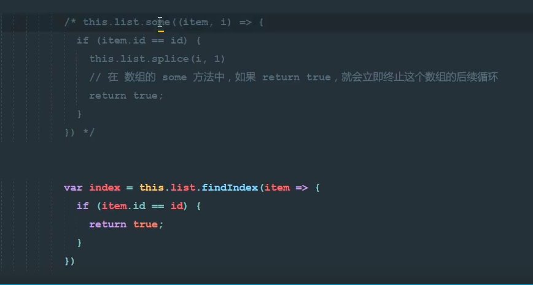

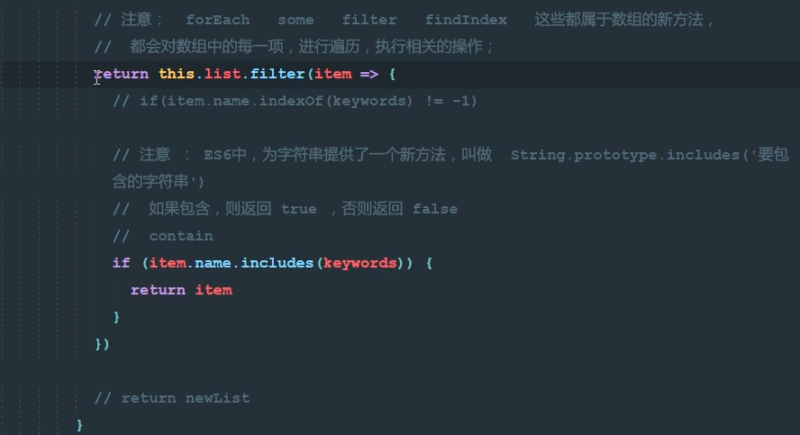

remove 可以采用es6的箭头函数


### 过滤器

+ 全局 和 局部的区别  
  + 全局 在new vue 上面
  + 局部 在Vue实例上的filters 所有过滤器集合 当前实例使用

``` js
//全局
Vue.filter（）Vue.filter('toUpper',function(){

}) // 转大写
```


### 局部过滤器：

.\vue.assets\1568103118456.png)

第三种方式


案例：


## 全局自定义指令 directive

### 全局：

`inserted`  如果要操作DOM元素 加入 这个

``` html
<body>
    <div id="app">
        <!-- <p>{{name}}</p> -->
        <input type="text" v-focus="123">
        <div v-text="content"></div>
    </div>
    <script src="../vue.js"></script>
    <script>
        // 全局指令
        Vue.directive('focus', {
            inserted(dom, expresstion) {
                dom.focus();
                dom.value = expresstion.value
            }
        })
        Vue.directive('text', {
            inserted(dom) {
                dom.value = expresstion.vlaue
            }
        })
        var vm = new Vue({
            el: '#app',
            data: {
                name: "123",
                content: '我是div 中的内容'
            },
            methods: {

            }
        });
    </script>
</body>
```

### 局部

+ 注意 在选项中 的是`directives`

语法：directive：{  key指令名称 （dom，expression） {  执行函数 }   } 

``` html
// inserted 的第二个参数  expresstion  他的属性是 expression.value

一般用法  dom.什么 = expresstion.value

directives: {
                focus: {
                    inserted(dom, expression) {
                        dom.focus()
                        dom.value = expression.value
                    }
                }
            }
```

案例：

``` html
<body>
    <div id="app">
        <input type="text" v-focus>
        <div v-html="content"></div>
    </div>
    <script src="../vue.js"></script>
    <script>
        var vm = new Vue({
            el: '#app',
            data: {
                name: "123",
                content: '<p style="color:red">123</p>',
            },
            methods: {

            },
            directives: {
                html: {
                    inserted(dom, expression) {
                        dom.innerHTML = expression.value;
                    }
                }
            }
        });
    </script>
</body>
```


## 计算属性 computerd:

语法：

`computed：{  key(计算属性的名称)：value（带返回值的函数（必须return）  }`

+ 场景  当 插值表达式 或者 v-bind 过于复杂的情况下可以采用计算机属性 对于任何复杂逻辑 都可以使用计算属性的方法 简单的逻辑也可以使用计算属性
+ methods 和 computed 的区别
  + methods 每次都执行 
  + computed 首先会执行一次，然后存到缓存区 下次使用的时候会和缓存区的对比 如果 有 则直接用缓存区的值 

+ 注意  计算属性中  异步  不能用  比如 ajax 和  settimeout
+ computed  不需要传参  直接调用即可 

代码：

``` html
<body>
    <div id="app">
        <p>{{reverseMsg}}</p>
        <input type="text" v-model="msg">
    </div>
    <script src="../vue.js"></script>
    <script>
        var vm = new Vue({
            el: '#app',
            data: {
                msg: "abc",
            },
            methods: {},
            computed: {
                reverseMsg() {
                    return this.msg.split("").reverse().join("")
                }
            }
        });
    </script>
</body>
```

案例：

``` html
<body>
    <div id="app">
        <p :class="{select}">哈哈哈哈</p>
        <p :class="selectClass">哈哈哈哈</p>
    </div>
    <script src="../vue.js"></script>
    <script>
        var vm = new Vue({
            el: '#app',
            data: {
                select: true
            },
            methods: {},
            computed: {
                selectClass() {
                    return this.select ? 'select' : ''
                }
            }
        });
    </script>
</body>
```

## 模糊查询 indexOf

代码

+ indexOf 也可以 用 startsWith 代替 不过 不能写 >-1

``` html
// 需要v-for 中  吧 list 都换成  filter 这个新数组
// 在标签内 调用 v-filter
computed: {
                filter() {
                    return this.list.filter((item) => {
                        return item.name.indexOf(this.searchValue) > -1
                    })
                }
            }
```

## Vue 的网络请求

1. 老版本会使用 vue-resource  自带方法 已经停止维护
2. 现在使用`axios` 库

+ 既可以在客户端使用 也可以在node.js中使用 发送 http请求的库
+ 支持`promise `
+ 不支持jsonp跨域 如果需要  可以赢 插件 `jsonp`


###  promise

+ 为了解决回调地狱的问题
+ 异步请求 接收返回值 只能在回调函数中
+ 如果下一个请求依赖于上一个请求

``` js
new promise(function(resolve,reject){
    if(flag === 1) {
        resolve('success') // 成功
    }else{
        reject（new Eroor('fail')） // 抛出错误
    }
}).then(result => {
	return axios{url,data:result}
}).cath(err=> {
    
})
```


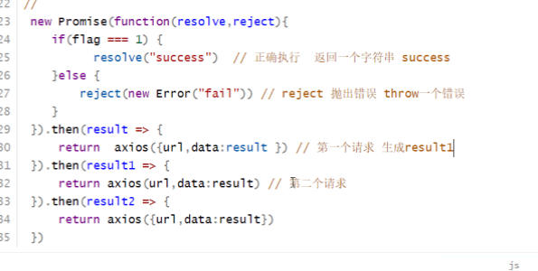

### axios

+ axios 返回的就是一个promise 对象

``` html
axios === new promise(function(resolve,reject){

})
axios().then(拿到返回数据（接口返回数据）).catch（err =>）
```

### json-server工具的使用

``` js
npm i -g json-server  // 还可以用 yarn 和 cnpm
```

``` js
json-server --watch db.json  //--watch 为 监视
```

+ .json 文件中 先写一个对象  里面放一个表名 然后在存放数据 

``` json
{
  "user": [{
      "name": "苹果",
      "date": "2018-05-30T08:07:20.089Z",
      "id": 1
    },
    {
      "name": "小米",
      "date": "2018-07-04T08:59:51.200Z",
      "id": 2
    }
  ]
}
```

+ 控制台 返回 `Resources http://localhost:3000/user`

其中 Resourcehttp://localhost:3000/user  在加一个 /id  表示  切换id 可以 读取json文件

## restful 接口规则

+ 用`不同的请求类型`发送`同样一个请求标识` 所对应的处理是`不同`的
+ 通过http请求 的不同类型 （post delete updata put get）来判断是什么业务操作
+ crud 增删改查
+ json-server  应用了restful 的规范

语法：

如果db.json 中的表名为 “user“

1. 增加一条数据 get /地址 {name:"lisi" , age : "18"}  // 这里不需要id
2. 删除单条数据 delete/ 地址 / id
3. 修改数据 put /地址 / id 修改内容 {name:"lisi" , age : "18"}
4.  查询数据 get /地址
   1.  查询单条数据 get 地址 / id
5. 模糊搜索 get/地址?字段名_like="关键字“

## axios的使用

axios调用的两种方式

+ 如果 用 axios（）.then（） 的方法请求get方式 可以省略里面写 method：'' , 因为默认为get 请求
+ 路径参数  也就是 url？id=3  之类的  写在axios对象中的 data属性中
+ post 请求成功的码为status = 201 别的都为200 

``` html
<body>
    <div id="app">

    </div>
    <script src="../vue.js"></script>
    <script src="../axios.min.js"></script>
    <script>
        //两种调用方式 
        //第一种
        axios.get("http://localhost:3000/user").then((result) => {
            console.log(result.data)
        });
        //第二种
        axios({
            url: 'http://localhost:3000/user',
            method：'get'，
            data：""
        }).then(result => console.log(result.data))
        var vm = new Vue({
            el: '#app',
            data: {},
            methods: {}
        });
    </script>
</body>
```

## watch属性

` 未学明白`

+ 当需要根据`数据变化 `进行`响应业务操作`，且该操作是`异步操作`时， **计算属性不能再使用**

+ 特征：
  + watch 是 监听data数据中的数据项的变化对象  数据项变化 watch监控函数执行
  + watch 不需要返回值 不需要return 
+ computed 和 watch 的区别：
  + 计算属性必要要有返回值 所以说不能写异步请求
  + watch 没有返回值

``` html
watch:{

	data中的属性项（newValue，oldValue）{
		逻辑
	}
}
```


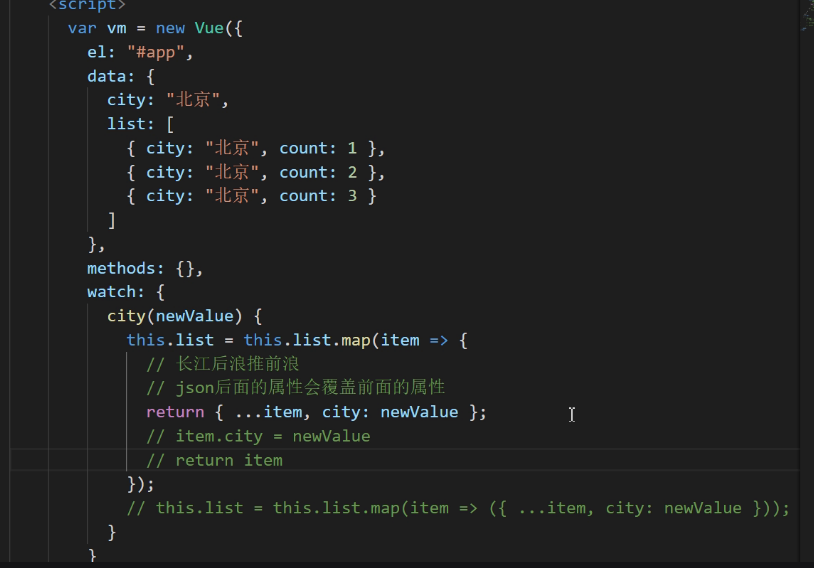


## 组件

+ vue 实例有el 选项  组件中 有 template 选项
+ data 中 需要 return{} 一个 新对象 相当于 new Object（）
+ template 中 需要一个 div 根标签
+ 每个组件都是独立运行的  没有关系

### 定义全局组件

``` html
Vue.component('组件名',{
	template : '<div>  写组件元素<p>{{name}}</p>  </div>',
	data(){
	return{
			name:'123'
		}
	}
	methods：{}
})
```

`注意 其中data 是一个返回对象  data（） {    }` 是个坑

案例：点击+ - 实现组件

三种方式判断

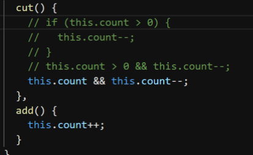

``` html
<body>

    <div id="app">
        <set></set>
        <set></set>
        <set></set>
        <set></set>
    </div>
    <script src="../vue.js"></script>

    <script>
        Vue.component("set", {
            template: `
        <div>
            <span @click="cut">-</span>
            <span>{{content}}</span>
            <span @click="add">+</span>
        </div>
    `,
            data() {
                return {
                    content: 0
                }
            },
            methods: {
                cut() {
                    this.content--
                },
                add() {
                    this.content++
                }
            }
        })
        var vm = new Vue({
            el: '#app',
            data: {},
            methods: {}
        });
    </script>
</body>
```

### 局部组件

就是把 Vue.component（） 换成 vue 属性选项中 的 components ：{  }   别的都一样  

+ 里面可以 继续嵌套一个  components：（）

#### 组件嵌套：

+ 在谁的组件中

组件通信的几种情况

#### 父组件给子组件传值

基本操作：

1. 先定义一个属性  给谁传值就给谁的标签上定义属性  名字随便起 但是不能重复 `：名字="父元素要穿的属性的名字"`
2. 接收props属性   和上面定义的名字一致 `写在 局部或者全局组件中`  不是实例对象选项下面
3. 调用  在 `template中直接{{}} 这样调用`即可

``` html
<body>
    <div id="app">
        <content-a :title="name"></content-a> //第一步
    </div>
    <script src="../vue.js"></script>
    <script>
        var obj = {
            template: `
            <div>
                <p>{{name}}</p>
                <p>{{title}}</p>			//第三步
            </div>
            `,
            data() {
                return {
                    name: '子元素'
                }
            },
            props: ["title"]			//第二步

        }
        var vm = new Vue({
            el: '#app',
            data: {
                name: '父元素'
            },
            methods: {},
            components: {
                "content-a": obj
            }
        });
    </script>
</body>
```

案例：父传子 城市

``` html
<body>
    <div id="app">
        <content-a :list="city"></content-a>
    </div>
    <script src="../vue.js"></script>
    <script>
        var obj = {
            template: `<div>
                    <p v-for="item in list">{{item}}</p>
                </div>`,
            data() {
                return {
                    content: ''
                }
            },
            props: ["list"]
        }
        var vm = new Vue({
            el: '#app',
            data: {
                city: ["bj", "cq"]
            },
            methods: {},
            components: {
                "content-a": obj
            }
        });
    </script>
</body>
```


### 子组件 给 父组件传值

+ $emit  => 相当于 在`当前实例`抛出一个`自定义`事件
+ 需要监听谁就在哪儿个标签

``` html
<body>
    <div id="app">
        <!-- 想监听谁写在哪儿个标签上 -->
        <contnent-a @getdata="data"></contnent-a>
        <p>{{name}}</p>
    </div>
    <script src="../vue.js"></script>
    <script>
        var obj = {
            template: `<div>
                    <button @click="btn">按钮</button>
                </div>`,
            data() {
                return {
                    name: "我是子组件元素"
                }
            },
            methods: {
                btn() {
                    // console.log(123)
                    this.$emit("getdata", this.name) //名字，抛出内容 相当于抛出了事件 name 用，隔开抛出东西
                }
            }
        }
        var vm = new Vue({
            el: '#app',
            data: {
                name: ''
            },
            methods: {
                data(name) {
                    this.name = name
                }
            },
            components: {
                "contnent-a": obj
            }
        });
    </script>
</body>
```


## SPA-单页应用

+ 传统模式每个页面和内容都需要从服务器一次次请求
+ SPA模式 第一次加载会将所有的资源都请求到页面 模块之间切换不会再请求服务器

SPA优点：

+ 速度快  `切换模块不需要经过网络请求`
+ 完全组件化开发 ，由于只有一个页面 所以原来属于一个个页面的工作被归类为一个个组件

SPA缺陷：

+ 首屏加载慢  如何解决=》 按需加载 不刷新页面请求js模块
+ 不利于SEO优化 =》 服务端渲染
+ 开发难度高

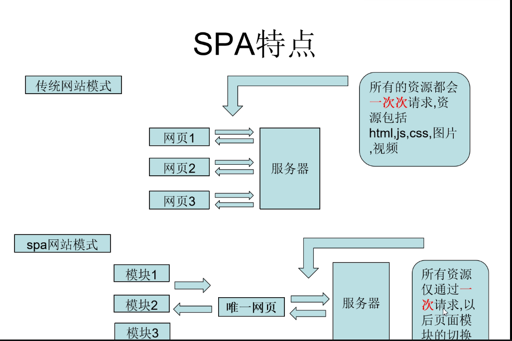

SPA原理：

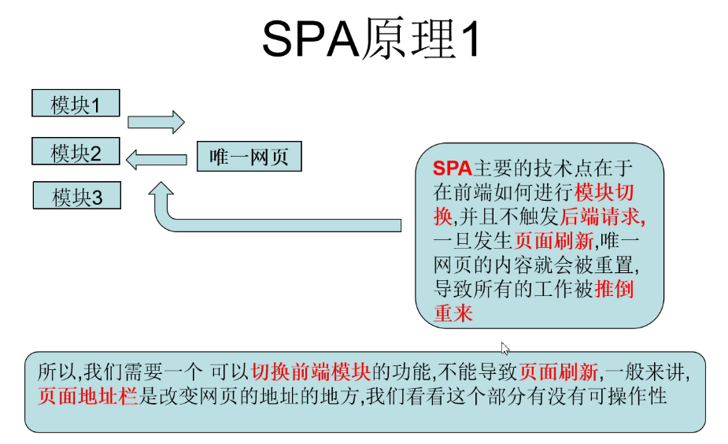

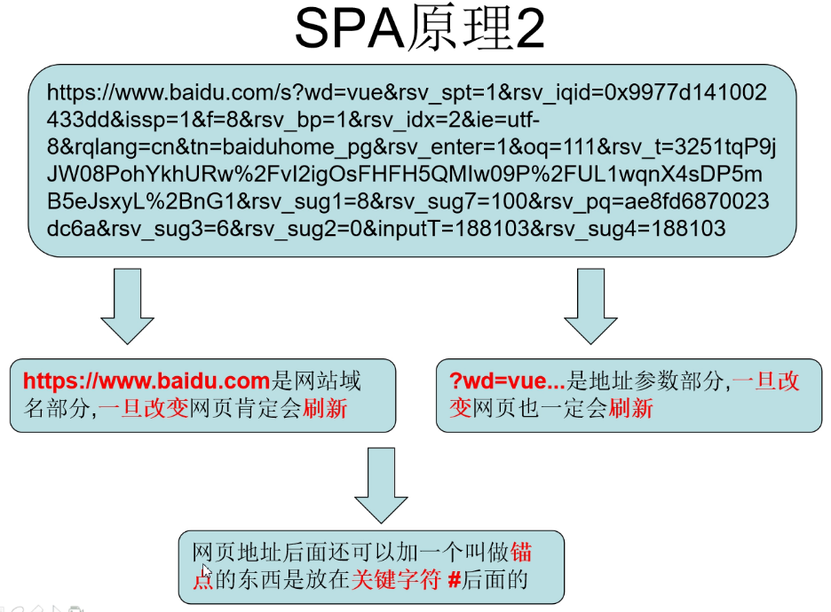

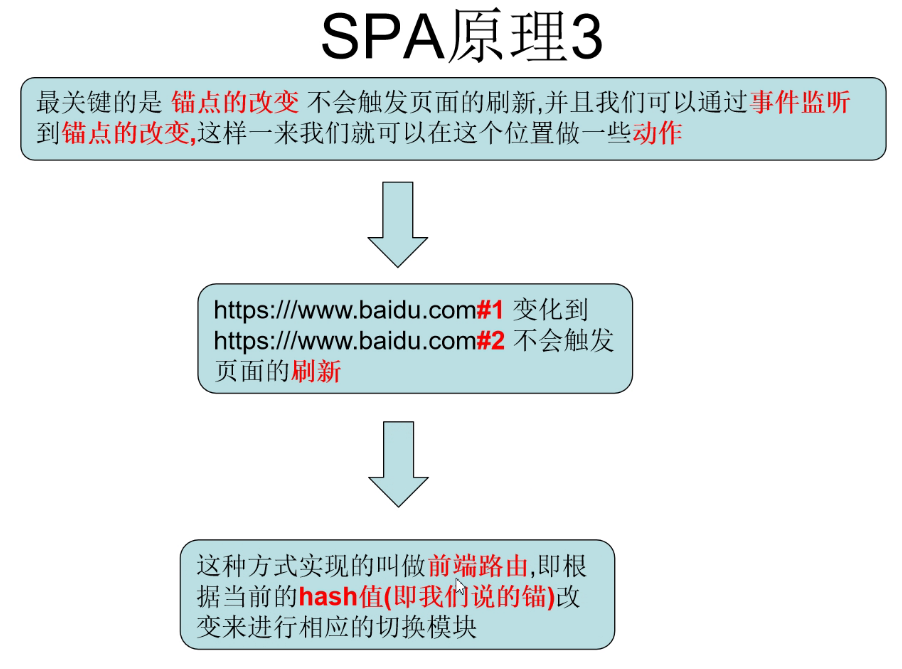

结论：

+ 可以通过页面地址 的 锚链接来实现
+ hash位于连接地址#之后
+ hash值的改变不会触发页面刷新
+ hash值是URL地址的一部分 会储存在页面地址上 我们可以获得到
+ 可以通过事件监听has值的改变
+ 拿到了hash值就饿看哟根据不同的hash值进行不动提供的模块切换
+ 前端路由 从模块一切换到模块二 叫前端路由

## js实现前端路由

案例：点击4个链接时页面能显示对应的城市

``` html
<body>
    <!-- 导航 -->
    <a href="#bj">北京</a>
    <a href="#tj">天津</a>
    <a href="#cq">重庆</a>
    <a href="#sh">上海</a>
    <!-- 容器 -->
    <div id="continer"></div>
</body>
<script>
    var fn = function () {
        var path = window.location.hash.substr(1)
        var dom = document.getElementById("continer")
        switch (path) {
            case 'bj':
                dom.innerText = "北京"
                break;
            case 'tj':
                dom.innerText = "天津"
                break;
            case 'cq':
                dom.innerText = "重庆"
                break;
            case 'sh':
                dom.innerText = "上海"
                break;

            default:
                break;
        }

    }
    window.onhashchange = fn
    fn()
</script>
```

## Vue-router 

+ vue-router 是官方的路由管理器 
+ 实现根据不同的请求地址而显示不同的组件

使用：

1. 引入js
2. 设置导航 router-link
3. 容器 router-view
4. 实例化 一个 vue-router 对象 var router = new VueRouter()
5. 配置路由表  hash对应的组件或者模板

``` html
//基本操作
<body>
    <div id="app">
        <router-link to="uzi">uzi</router-link>
        <router-link to="777">明凯</router-link>
        <router-link to="skt">Faker</router-link>
        <router-view></router-view>
    </div>
    <script src="../vue.js"></script>
    <script src="../vue.router.js"></script>
    <script>
        var router = new VueRouter({
            routes: [{
                    path: "/",
                    component: {
                        template: `<div>LOL伟大的召唤师</div>`
                    }
                }, {
                    path: "/uzi",
                    component: {
                        template: `<div>一场金色的雨</div>`
                    }
                }, {
                    path: "/777",
                    component: {
                        template: `<div>7酱</div>`
                    }
                }, {
                    path: "/skt",
                    component: {
                        template: `<div>Faker大魔王</div>`
                    }
                },

            ]
        })
        var vm = new Vue({
            el: '#app',
            data: {},
            methods: {},
            router
        });
    </script>
</body>
```

### 动态路由

- 点击列表页跳转到详情页是跳转的链接需要携带参数会导致页面路径不同
- 当路径不同却需要对应同一个组件时需要用到动态路由这一概念

操作：

[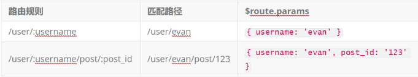](https://github.com/RainAndLight/My_Node/blob/master/vue.assets/1568474674592.png)

1. 在路由表中的路径中后面加一个参数：id
2. 在router-link中加入实参/ stem /勇士

```html
< body >
    < div  id = “ app ” >
        < router-link  to = “ / lol / uzi ” > uzi </ router-link >
        < router-link  to = “ / lol /明凯” >明凯</ router-link >
        < router-link  to = “ / lol / Faker ” > Faker </ router-link >
        < router-view > </ router-view >
    </ div >
    < script  src = “ ../vue.js ” > </ script >
    < script  src = “ ../vue.router.js ” > </ script >
    < script >
        var router =  new  VueRouter（{ 
            routes ： [{ 
                path ： “ / ”，
                component ： { 
                    template ： ` <div> LOL伟大的召唤师</ div> `
                 } 
            }，{ 
                path ： ' / lol /：name '，
                组件： { 
                    template ： ` <div>我是{{$ route.params.name}}的粉丝</ div> `
                 }
            }] 
        }）
var vm = new Vue（{             el ：'＃app '，            data ： {}，            methods ： {}，            router         }）; </ script >          
 


    
</ body >
```

## 重新定向

```js
redirect："路径"
```

### 编程式导航

- this.r $路由器可以拿到当前路由对象的实例
- 路由对象的实例方法有push replace go（）

## 嵌套路由

- 初始化一个路由
- 二级路由用`children ： []`
- 二级`写默认` `path 则为 空`路由中如果要即可，也就是路径为“”时候代表默认一级路由
- 二级路由写路径时可以省略/副路由直接写子路由也就是 `如果要写斜杠 则路径需要写全，如果不写斜杠 则可以直接写`

案例：

- 准备写二级路由的时候，在一级路由中的模板中写二级路由的link和view其中link的锚点路径记得加一级路由`前缀`

```html
< body >
    < div  id = “ app ” >
        < router-link  to = “ /游戏” >游戏</ router-link >
        < router-link  to = “ /教育” >教育</ router-link >
        < router-link  to = “ /音乐” >音乐</ router-link >
        < router-view  class = “ father ” > </ router-view >
    </ div >
    < script  src = “ ../vue.js ” > </ script >
    < script  src = “ ../vue.router.js ” > </ script >
    < script >
        var router =  new  VueRouter（{ 
            routes ： [{ 
                path ： ' / '，
                redirect ： ' /游戏'
             }，{ 
                path ： ' /游戏'，
                组件： { 
                    模板： ' <div>欢迎来到BeiJing </ div> '
                 } 
            ，{ 
                path ： ' /教育'，
                组件： { 
                    template ： ' <div>我是教育</ div> '
                 } 
            }，{ 
                路径： ' /音乐'，
                组件： { 
                    模板： ` <div> 
                        <p>我是音乐</ p> 
                        <router-链接到=“/音乐/游戏”>二次元</ router-link> 
                        <router-link to =“/音乐/音乐”>轻音乐</ router-link> 
                        <router-link to =“/音乐/ rap” >说唱</路由器链路>
                        <router-view class =“son”> </ router-view> 
                        </ div> `
                 }，
                children ： [{ 
                    path ： “ ”，
                    component ： { 
                        template ： ` <div>欢迎来到bilibili </ div> `
                     } 
                ，{ 
                    path ： ' game '，
                    component ： { 
                        template ： '<div>二次元</ div> '
                     } 
                }，{ 
                    路径： '音乐'，
                    组件： { 
                        模板： ' <div>轻音乐</ div> '
                     } 
                }，{ 
                    路径： '说唱'，
                    组件： { 
                        模板： ' <div> rap </ div> '
                    } 
                }] 
            }]
        }）
var vm = new Vue（{             el ：'＃app '，            data ： {}，            methods ： {}，            router，        }）; </ script >          
 


    
</ body >
```

## vue-cli工具

- 是一个命令行工具也支持图形化
- node.js开发的
- 暂时不关注原理

安装：

```bash
npm install -g cnpm --registry = https：//registry.npm.taobao.org
cnpm i - g @vue / cli //全局安装脚手架
npm install -g @ vue / cli-init //兼容2.0
```

创建一个项目：（V 2.0）

```bash
$ vue init webpack-simple heroes //英雄为项目名称
$ npm run dev //跑起来
```

创建一个项目：（V 3.0）

```bash
$ vue create heroes // create（创建）为关键字
 ＃切换到当前目录 
$ cd   heroes
//下依赖
我是谁
＃在开发模式下启动运行项目 
$ npm run serve
```

### vue-cli项目解释

> .bablelr =>存放babel编译的配置信息
>
> .editorconfig =>存放编辑器的配置信息
>
> .gitignore => git忽略文件
>
> index.html =>单页应用的html
>
> package.json =>用于存放依赖信息及其他项目信息
>
> README.md =>项目介绍信息github上的页面信息
>
> webpack.config.js => wepack工具的配置文件=> webpack是一个前端工程化的工具

- npm run dev（开发期）之后node.js会将main.js打包成build.js
- build.js不是一个屋里文件是一个在内存中的二进制流
- npm run build（开发完成）生成物理文件build.js上线
- main.js实例化vue `整个项目的根组件`
- 嵌套其他组件
- 引用组件导入表格
- 使用组件导出
- 会将main中所有的import引用

```bash
- 救
-S运行时依赖
-D开发依赖
```

## ES6中的引出和引入

node.js中用require和from this个react vue angular都可以使用

### 导入：

```js
 从“ vue ” //别名和地址导入Vue   
```

- 导入模板
- Vue为别名
- 后面引号为路径比如“./App.vue”但是如果引入包则可以直接写包名
- 在main.js中实例vue为项目的根组件，可以无限嵌套组件

### 导出：

- 是个组件其中template在外面写

```js
export  default {
    
}
```

- .vue这个文件默认导出

## VUE单文件组件及入口解析

- 模板脚本风格相当于html + js + css
- 全局组件中除了router都可以写

引入css less sass等main中导入“路径”

[](https://github.com/RainAndLight/My_Node/blob/master/vue.assets/1568531974810.png)

## 示例项目效果演示

+ 有路由 还有二级路由 嵌套路由

+ ``` bash
  --save 和 -S  都是添加运行依赖
  ```


## 基础-示例项目-提取路由模块

**`目标-任务`** 在示例项目中 提取路由模块,并应用视图

> **`路径`**  提取路由模块
>
> 1  安装路由 
>
> ```bash 
> npm i vue-router // 安装路由模块
> ```
>
> 2   在**main.js**中引入 路由模块
>
> ```js
> import VueRouter from 'vue-router ' // 引用router
> ```
>
> 3  使用router 
>
> ```js 
> Vue.use(VueRouter) // 使用router
> ```
>
> 4   实例化 router 
>
> ```js 
> const router = new VueRouter({
> routes:[] //实例化routes
> })
> ```
>
> 5  配置理由表
>
> ```js
> const router = new VueRouter({
> routes: [
> { path: "/heroes", component: AppList },
> { path: "/foo", component: Foo },
> { path: "/bar", component: Bar }
> ] // 路由表
> }); // 实例化router
> ```
>
> * 挂载到路由上的组件 => 路由级组件 => 原来的一个个页面
>
> **注意** 一般来说 路由表 需要单独一个文件   可以将router提取成一个js文件 
>
> 6   提取 三个组件 appList(主要 )  Foo(组件) Bar(组件) 完善路由表
>
> ```html
> <template>
> <div>Bar组件</div>
> </template>
> 
> <script>
> export default {};
> </script>
> 
> <style>
> </style>
> ```

## 优化

+ 优化axios
+ 优化请求头
+ 整理目录
  + 组件分类
  + 路由级组件
  + pages/views
  + 普通组件
+ 过渡

## 钩子函数

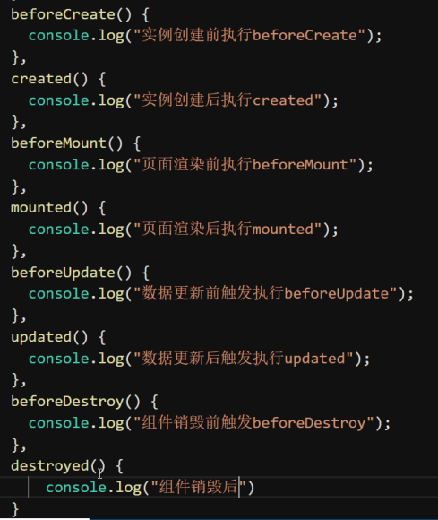

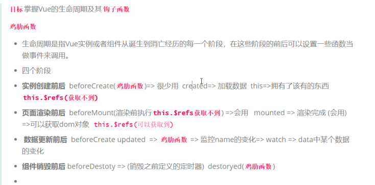

四个阶段：

beforeCreate


## elementUI框架

安装：

``` bash
cnpm i element-ui -S
```

在main.js引入 框架 全局路由 css

``` js
import ElementUI from "element-ui"
import 'element-ui/lib/theme-chalk/index.css'
Vue.use(ElementUI)
```

## ESlint


## 插槽

### 默认插槽

在子组件中用slot占据位置，在父逐渐中传入提花你内容的方式

父组件

``` html
<template>
  <div>
    hello word
    <child-a>
      <span style="color:red">黑马</span>    //这里这个地方占坑
    </child-a>
  </div>
</template>

<script>
import child from "./defaultslotChild";
export default {
  components: {
    "child-a": child
  }
};
</script>

<style>
</style>
```

子组件

``` html
<template>
  <div>
        
      <p><slot></slot>牛逼</p>   // slot 中的内容就是父组件中的占坑内容
      <p><slot></slot>强</p>
      <p><slot></slot>吊</p>
  </div>
</template>

<script>
export default {};
</script>

<style>
</style>
```

### 后备插槽

+ ​    <button>

  ​      <child-a>登录</child-a>

  ​    </button>   

  `此时登录为后备内容 如果 子组件中 slot 有内容  则用子组件的内容`

``` html
<template>
  <div>
    用户名：
    <input type="text" />
    <br />密   码：
    <input type="text" />
    <br />
    <button>
      <child-a>登录</child-a>
    </button>
    <button>
      <child-a></child-a>
    </button>
  </div>
</template>

<script>
import child from "./defaultslotChild";
export default {
  components: {
    "child-a": child
  }
};
</script>

<style>
</style>
```

``` html
<template>
  <div>
    <slot>注册</slot>
  </div>
</template>

<script>
export default {};
</script>

<style>
</style>
```

### 具名插槽

传入不同的位置的内容去替换不同位置的slot属性

定义一个name属性

+ 在 子组件中 的 slot 中 加一个name属性
+ 父组件中 如果想要调用这个slot 就在标签中写 <p slot="name">

### 作用域插槽

+ 调用子组件中的属性  应该调用 ：abc=“name” 中的abc

``` html
<template>
  <div>
    <child-a>
      <template slot-scope="o">{{o.abc + o.def}}</template>
    </child-a>
  </div>
</template>

<script>
import child from "./defaultslotChild";
export default {
  components: {
    "child-a": child
  }
};
</script>

<style>
.a {
  width: 800px;
  height: 300px;
  background: red;
}
.aa {
  width: 800px;
  height: 100px;
  background-color: green;
}
.b {
  width: 800px;
  height: 100px;
  background-color: blue;
}
.c {
  width: 800px;
  height: 100px;
  background-color: black;
}
</style>
```

``` html
<template>
  <div>
    <slot :abc="name" :def="age"></slot>
  </div>
</template>

<script>
export default {
  data(){
    return {
      name : '这是子组件中名字name=亚丝娜',
      age : '子组件中的age=18'
    }
  }
};
</script>

<style>
</style>
```

