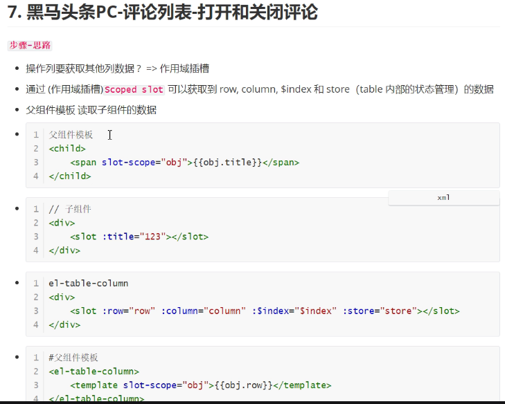
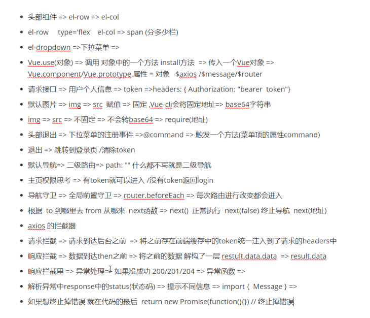

## 创建项目

### vue-cli

cnpm i - g @vue / cli //全局安装脚手架

npm install -g @ vue / cli-init //兼容2.0


2.0版本创建

$ vue init webpack-simple heroes //英雄为项目名称

$ npm i //安装依赖

$ npm run dev //跑起来

## 部署静态资源

在app.vue中 import from 引入静态文件

引入bootstrap.css  固定版本

## 添加router 依赖

cnpm i vue-router -S  

app.vue 中 也引入这个包

## db.json服务器启动

创建db.json 的文件 引入数据

json-server --watch db.json

## 列表的渲染

## 项目笔记：

+ 背景图片  bg-i : url

+ height ： 100vh 可视区域

+ bgc-s : cover   cover 自适应

+ <style lang='less'> 可以写less了

### scoped属性

<style lang='less' scoped>

如果加这个属性，name该style 就会只对当前组件有效

### float left  

# element使用

## element 表单验证

<el-from>

​				<el-from-item>

​						<el-input> 内容<el-input>

​				<el-from-item>

</el-from>

### 自动验证前的三步

1.  ``` js
   export default {
     data () {
       return {
         loginFrom: {
           mobile: '',
           code: '',
           agree: ''
         }
       }
     }
   }
   ```

   + 绑定 v-model=''  data中的数据

   ``` js
   <el-input v-model='loginFrom.mobile' placeholder="请输入手机号"></el-input>
   ```
   
   + <el-from :model='loginFrom'>

2. <el-form :model='loginFrom' :rules='loginRules'> 绑定规则

3. ``` vue
   <el-form-item prop='mobile'>
             <el-input v-model='loginFrom.mobile' placeholder="请输入手机号">		</el-input>
   </el-form-item>
   ```

   + 每个item 中 绑定 prop校验 值为 input中model中的`字段`

### 手动验证

1. 给from表单定义一个 ref属性

``` js
<el-form ref='myFrom' :model='loginFrom' :rules='loginRules'>
```

2. 注册点击事件

``` js
<el-button  type="primary" class="denglu" @click="login">登录</el-button>
```

3. validate 校验函数的使用

``` js
methods: {
    login () {
      // 方法中传入的一个函数 两个校验蚕食 是否校验成功的字段和没有成功的字段
      this.$refs.myFrom.validate(function (isok) {
        if (isok) { console.log(123) }
      })
    }
  }
}
```

### 验证规则

``` js
mobile: [{ required: true, message: '139，8个8 ，写吧' }, { pattern: /^(0|86|17951)?(13[0-9]|15[012356789]|166|17[3678]|18[0-9]|14[57])[0-9]{8}$/, message: '手机号写的不对' }],
        code: [{ required: true, message: '验证码246810，写吧' }, { pattern: /^\d{6}$/, message: '请输入正确的6位验证' }]
```

### 自定义规则

rule :  当前规则

value ： 值

callback ： 回调函数

``` js
agree: [{
          validator: function (rule, value, callBack) {
            value ? callBack('okokok') : callBack('得勾选呐')
          }
        }]
```

## 侧边导航栏

用法：

+ 先套个div 控制 宽 高 背景颜色等

+ 里面两个div  title 和 <el-menu>

+ <el-menu> 中的使用

  + 一级导航 不带下拉选项的用 <el-menu-item> 首页</el-menu-item>

  + 一级导航 带下拉选项的 <el-submenu> </el-submenu>

    + 下拉选项的标题用 <template slot="title">内容管理 <template>  //必须有插槽

    + 标题选项用 <el-menu-item-group> 包住 里面选项 内容用<el-menu-item>

    + 二级菜单 

      <el-menu-item-group>

      <template slot="title">分组一</template>
      <el-menu-item index="1-1">选项1</el-menu-item>
      <el-menu-item index="1-2">选项2</el-menu-item>
      </el-menu-item-group>


## 全局注册插件的使用方法Vue.use（）

实现原理：


+ 注册了全局组件就可以随意使用组件

``` js
// 整体组件的统一注册
import layAside from './home/lay-aside'
import layHeader from './home/lay-header'
export default {
  install (Vue) {
    console.log(Vue)
    Vue.component('lay-aside', layAside)
    Vue.component('lay-header', layHeader)
  }
}
```

## 头像和账户信息的获取

### axios请求数据 和 elementUI 下拉菜单组件

``` js
<script>
export default {
  data () {
    return {
      userInfo: {}
    }
  },
  methods: {
    handleCommand (command) {
      console.log(this.$message('click on item ' + command))
    },
    getUserInfo () {
      let token = window.localStorage.getItem('token')
      this.$axios({
        url: '/user/profile',
        headers: { Authorization: `Bearer ${token}` }
      }).then(result => {
        console.log(result)
        this.userInfo = result.data.data
      })
    }
  },
  created () {
    this.getUserInfo()
  }
}
</script>
```


## 本地地址转义

`require（../.../home/index.jpg） 转成base64`

+ 如果img中的地址不固定 则不能自动转化成base64
+ 手动转base64  require（../.../home/1.jpg） 
+ 线上地址不需要转base64

## 清除本项目的前端缓存

``` js
window.localStorage.clear()
```


## 左侧导航栏index路由配置

+ 在 el-menu 标签中 写 `:router="true" 这个等价于直接写 router`
+ 跳转的地址

| path           | 功能     | 备注         |
| -------------- | -------- | ------------ |
| /login         | 登录     | **一级路由** |
| /home/publish  | 发布文章 | 二级路由     |
| /home/articles | 文章列表 | 二级路由     |
| /home          | 首页     | **一级路由** |
| /home/comment  | 评论     | 二级路由     |
| /home/material | 素材     | 二级路由     |
| //home/fans    | 粉丝     | 二级路由     |
| /home/account  | 个人设置 | 二级路由     |


## 导航守卫

+ 全局的  单个路由独享的   或者 组件级的

### router.beforeEach 全局前置守卫

在每一个路由发生改变之前 都会触发这个事件

``` js
router.beforeEach(funciton(to,from,next){})
```

+ to:Router 即将进入的目标 路由对象
+ from：router 当前导航要离开的目标
+ next：function 一定要调用该方法来`resolve `这个钩子
  + next（）三种用法
  +  next（） 直接通过
  + next（false）中断
  + next（'/login'）跳转

使用：

1. 创建js ， 引用 router

2. 设置全局前置守卫

   router.beforEach（）

## axios 拦截器统一处理token

``` js
//请求拦截
axios.inerceotors.request.use(funciion(config){
    return config;
	},function(error){
    return Promise.reject(error)

})
//响应拦截
axios.inerceotors.response.use(funciion(config){
    return config;
	},function(error){
    return Promise.reject(error)

})
```

### 请求拦截代码：

``` js
// 设置request拦截器 给请求统一追加 token
import axios from 'axios'

axios.interceptors.request.use(
  function (config) {
    let token = window.localStorage.getItem('token')
    config.headers['Authorization'] = `Bearer ${token}`
    return config
  },
  function (error) {
    return Promise.reject(error)
  })
export default axios
```

### 响应拦截

+ 响应数据回来到达then之前

## 评论列表 操作 关闭评论

+ 作用域插槽  父传子  

评论区代码：

``` js
<template>
  <el-card>
    <!-- header 为card中的 头部具名插槽 -->
    <bread-crumbs slot="header">
      <!-- title 面包屑插槽 -->
      <template slot="title">评论列表</template>
    </bread-crumbs>
    <el-table :data="list">
      <el-table-column width="600px" prop="title" label="标题"></el-table-column>
      <el-table-column :formatter="formatter" align="center" prop="comment_status" label="评论状态"></el-table-column>
      <el-table-column align="center" prop="total_comment_count" label="总评论数"></el-table-column>
      <el-table-column align="center" prop="fans_comment_count" label="粉丝评论数"></el-table-column>
      <el-table-column align="center" label="操作">
        <template slot-scope="obj">
          <el-button size="mini" type="text">修改</el-button>
          <el-button size="mini" type="text">{{obj.row.comment_status ? '打开评论' :'关闭评论' }}</el-button>
        </template>
      </el-table-column>
    </el-table>
  </el-card>
</template>

<script>
export default {
  data () {
    return {
      list: []
    }
  },
  methods: {
    formatter (row, column, cellValue, index) {
      // element-ui table表格 中不能显示 布尔值 所以用这个方法
      return cellValue ? '关闭' : '正常' //  （行信息，列信息，cellValue为判断布尔值，索引下标）
    },
    getComment () {
      this.$axios({
        url: '/articles',
        method: 'GET',
        params: { response_type: 'comment' } // 是路径参数
      }).then(result => {
        this.list = result.data.results
      })
    }
  },
  created () {
    this.getComment()
  }
}
</script>

<style>
</style>

```




## 面包屑组件的封装

全局封装

## 新建页面挂载路由

疑问

解释


## el-table 组件 评论列表


## 统一处理大数字类型

+ javascript 计算数字的时候   安全范围如果超过了一定的数字大小   计算就会失真    于是就不正确了
+ 最大安全数字 Number.MAX_SAFE_INTEGER = 9007199254740991
+ json.parse  超过最大安全数字就不精确了
+ axios 会 调用这个
+ 换方法 json-bigint 包

使用


## 发布文章

## 弹层

### el-diaolog


### 发布文章 封面图片中 子组件给父组件传值

$emit


## elementUI 分页实现的原理

组件挂载

``` html
<el-row justify='center' type='flex' style='margin:20px 0'>
      <el-pagination background layout="prev, pager, next" :total="1000"></el-pagination>
</el-row>
```


+ 标签内 这三个属性对应上

``` html
//变成这个样子
<el-pagination
        @current-change="currentChange"
        :total="page.total"
        :current-page="page.currentPage"
        :page-size="page.pageSize"
        background
        layout="prev, pager, next"
      ></el-pagination>
```

+ 自带事件
+ 

直接调用有数据的axios 接口中的数据


``` js
data () {
    return {
      list: [],
      page: {
        total: 1000,
        currentPage: 1,
        pageSize: 10
      }
    }
  },
```


``` js
// 分页的方法
    currentChange (newPage) {
      this.page.currentPage = newPage
      this.getComment()
    },
```

newPage 为自带的一个参数 换页的时候的页数


``` js
getComment () {
      this.$axios({
        url: '/articles',
        method: 'GET',
        params: { response_type: 'comment', page: this.page.currentPage } // 是路径参数
      }).then(result => {
        this.list = result.data.results
        // 加载分页数据
        this.page.total = result.data.total_count
        // this.page.currentPage = result.data.page
      })
    },
```


## v-loading  遮罩

+ 在需要遮罩的标签内 写这个指令 v-loading：变量
+ data数据中 变量 ： **false** 
+ 在axios 求请前 **loading: true**,
+ 在axios 响应后 **loading: false,**


## 素材列表的实现

``` html
//基本组件代码
<template>
      <el-tabs v-model="activeName" @tab-click="handleClick">

        <el-tab-pane label="素材列表" name="all">
            素材列表
        </el-tab-pane>

        <el-tab-pane label="收藏列表" name="collect">
            收藏列表
        </el-tab-pane>

      </el-tabs>
</template>
```


## echarts.j

[官网]{https://www.echartsjs.com/zh/tutorial.html#5%20%E5%88%86%E9%92%9F%E4%B8%8A%E6%89%8B%20ECharts](https://www.echartsjs.com/zh/tutorial.html#5}

1. 下载安装

``` bash
npm i echarts -S
```


2. vue中引入

``` bash
import eacharts from 'echarts'
```


3. echarts 是用需要dom元素 需要给一个盒子·`必须有宽高`


4. 获取之前准备好的dom元素  对图表进行初始化，并且得到一个图标的实例

+ monted  可以获取到dom元素

``` js
let wirkChart = eacharts.init(this.$refs.word)
```

5. 用得到的图标实例来进行图表的渲染 调用一个图表的方法 `setOption`

## await 和 async


## articles.js

​		


## 打包

``` bash
npm run build
```


# 面试


1. 前端new对象时 干了什么
   1. 声明obj对象
   2. 对象call一个方法
2. JS基础
3. 笔试题