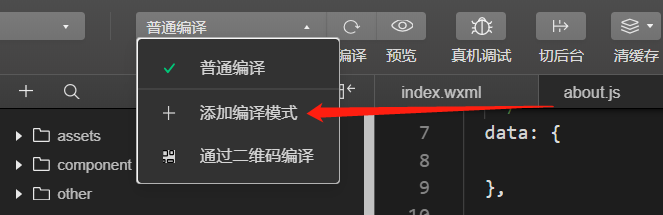
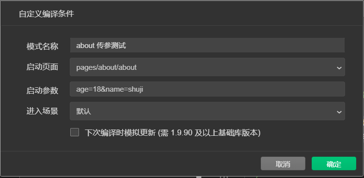

#### 小程序基础知识-day02

#### 课程目标

+ 能够知道小程序中的事件绑定和事件传参
+ 能够了解wxs的作用和使用
+ 能够知道wx:if和hidden的条件渲染
+ 能够知道wx:for列表渲染
+ 能够知道如何定义页面事件（上拉、下拉、滑动、分享）
+ 能够知道如何实现页面导航跳转
+ 能够实现小程序中的get、post请求

#### 01事件绑定和事件传参

###### 001 -  绑定触摸事件

在小程序中，不存在网页中的 `onclick` 鼠标点击事件，而是通过 `bindtap` 事件来响应触摸行为

+ 直接通过bindtap来绑定点击事件

  ```html
  <button bindtap="tapHandle">点我啊，老弟</button>
  ```

+ 对应的事件函数应该定义到对应的js文件中的data、生命周期的同级即可

  ```js
  tapHandle (even) {
    // 默认的第一个参数为事件对象
    console.log(even)
  },
  ```


###### 002 -  事件传参

小程序中事件传参错误写法

```html
<button bindtap="tapHandle(1)">点我啊</button>
```

- 在小程序中通过data-自定义属性的形式进行传参

  ```html
  <button bindtap="tapHandle" data-num="1" data-age="19">点我啊</button>
  ```

- 在事件函数内部通过事件对象来接收参数

  ```js
  // tap的事件处理函数
    tapHandle (even) {
      console.log(even.target.dataset.num)
      console.log(even.target.dataset.age)
    }
  ```

#### 02-文本框与data数据同步和wxs的基本使用（了解）

##### 2.1 文本框与data数据同步

+ 在小程序中是没有v-model这个指令的

+ vue中v-model的原理
  + 将data里面的数据绑定到输入框上
  + 给输入框绑定input事件，检测输入框发生变化
  + 将发生变化的最新的输入框的值同步给data即可

+ 实现小程序中文本框和data同步

  + 在data里面定义一个数据value

  + 通过mustache语法将data的数据绑定到输入框上

    ```html
    <input value="{{value}}"></input>
    ```

  + 检测输入框发生变化，绑定input事件

    ```html
    <input value="{{value}}" bindinput="inputHandle"></input>
    ```

  + 定义事件处理函数，通过事件对象even.detail.value获取到发生变化的值

    ```js
    // 输入框发生变化的事件处理函数
    inputHandle (even) {
      console.log(even.detail.value)
    }
    ```

  + 拿到输入框的值之后，利用setData方法给data里面的数据进行同步

    ```js
    // input的处理函数
    inputHandle (even) {
      console.log(even.detail.value)
      console.log(this.data.value)
      // 通过下面这种方式修改数据，只会让数据同步，页面不会跟着同步
      // this.data.value = even.detail.value
      // 通过setData这个方法来同步数据：1，能够修改data中的数据 2，当修改数据之后，再将数据同步给页面
      this.setData({
        value: even.detail.value
      })
    },
    ```


##### 2.2、 `WXS` 脚本简介

###### 001 - 什么是 `wxs`

- `wxs` 是小程序的一套脚本语言，结合 `wxml` ，可以构建出页面的结构
- ```wxs```的作用就是简化{{}}内部的模板语法

###### 002 - `wxs` 的注意事项

- 没有兼容性
  - `wxs` 不依赖于运行时的基础库版本，可以在所有版本的小程序中运行
- 与 `javascript` 不同
  - `wxs` 与 `javascript` 是不同的语言，有自己的语法，并不和 `javascript` 一致
- 隔离性
  - `wxs` 的运行环境和其他 `javascript` 代码是隔离的
  - `wxs` 中不能调用其他 `javascript` 文件中定义的函数，也不能调用小程序提供的`API`
- 不能作为事件回调
  - `wxs` 函数不能作为组件的事件回调
- `iOS`设备上比 `javascript` 运行快
  - 由于运行环境的差异，在 `iOS` 设备上小程序内的 `wxs` 会比 `javascript` 代码快 2 ~ 20 倍。
  - 在 `android` 设备上二者运行效率无差异 

###### 003 -  `wxs` 遵循 `CommonJS` 模块化规范

> `CommonJS` 是 `javascript` 的模块化规范之一，小程序的脚本语言 `wxs` 遵循了 `CommonJS` 规范，因此，使用 `wxs` 时的体验和使用 `node.js` 的体验比较相似。

- `module` 对象
  - 每个 `wxs` 都是独立的模块，每个模块均有一个内置的 module 对象，每个模块都有自己独立的作用域。
- `module.exports`
  - 由于 `wxs` 拥有独立作用域，所以在一个模块里面定义的变量与函数，默认为私有的，对其他模块不可见，
  - 通过 `module.exports` 属性，可以对外共享本模块的私有变量与函数。
- require函数
  - 在 `wxs` 模块中引用其他 `wxs` 文件模块，可以使用 `require` 函数。


- `WXS` 语言目前共有以下8种数据类型：
  - `number` 数值类型
  - `string` 字符串类型
  - `boolean` 布尔类型
  - `object` 对象类型
  - `function` 函数类型
  - `array` 数组类型
  - `date` 日期类型
  - `regexp` 正则

------

##### 2.4、内嵌 `wxs` 脚本

###### 001 - 使用规则

- `wxs` 代码可以编写在 `wxml` 文件中的 `<wxs></wxs>` 标签内，就像 `javascript` 代码可以编写在 `html` 文件中的 `<script></script>` 标签内一样。
- `wxml` 文件中的每个 `<wxs></wxs>` 标签，**必须提供一个 `module` 属性**，用来指定当前 `<wxs></wxs>` 标签的模块名。
- module 属性值的命名必须符合下面两个规则：
  - 首字符必须是：字母（a-z A-Z），下划线（_）
  - 剩余字符可以是：字母（a-z A-Z），下划线（_）， 数字（0-9） 

###### 002 -  案例代码

```html
<view>
  小明同学的分数为：{{ wxs_util.fractionFormat(fraction) }}
</view>

<wxs module="wxs_util">
module.exports = {
  fractionFormat: function(fraction){
    return fraction>=80 ? "优秀" : "一般"
  }
}
</wxs>
```

------

#### 03-wxs外联和小程序条件渲染的使用

##### 3.1、外联 `wxs` 脚本文件

###### 001 - 使用规则

- `wxs` 代码可以编写在以 `.wxs` 为后缀名的文件内，就像 j`avascript` 代码可以编写在以 `.js` 为后缀名文件中一样。
- 在 `wxml` 中如果要引入外联的 `wxs` 脚本，必须为 `<wxs></wxs>` 标签添加 `module` 和 `src` 属性。
  - `module` 用来为 `<wxs></wxs>` 标签指定模块名，作为当前页面访问这个模块的标识名称；
  - `src` 用来指定当前 `<wxs></wxs>` 标签要引入的脚本路径，必须是相对路径；

###### 002 - 案例代码

```javascript
// .wxs 文件
module.exports = {
  fractionFormat: function(fraction){
    return fraction>=80 ? "优秀" : "一般"
  }
}
```

```html
<view>
  小明同学的分数为：{{ wxs_util.fractionFormat(fraction) }}
</view>
<wxs src="../tools.wxs" module="wxs_util"></wxs>
```

**注意：**

+ **在 `wxs`中不要使用高级的`JS`语法**
+ 如果一个 `wxs` 模块在定义之后，一直没有被引用，则该模块不会被解析与运行。

------

##### 3.2、条件渲染

###### 001 -  `wx:if`

- 在小程序中，使用 `wx:if="{{condition}}" `来判断是否需要渲染该组件
- 也可以用 `wx:elif` 和 `wx:else` 来添加一个 else 块

```html
<view>
  <text>小明的成绩属于：</text>
  <text wx:if="{{fraction>=80}}">优秀</text>
  <text wx:elif="{{fraction<80&&fraction>60}}">良好</text>
  <text wx:elif="{{fraction<60}}">较差</text>
</view>
```

###### 002 - `block wx:if`

- 因为 `wx:if` 是一个控制属性，需要将它添加到一个标签上。
- 如果要一次性判断多个组件标签，可以使用一个 `<block></block>` 标签将多个组件包装起来，并在上边使用 `wx:if` 控制属性。
- **`<block/>` 并不是一个组件，它仅仅是一个包装元素，不会在页面中做任何渲染，只接受控制属性。**

```html
<view>
  <text>小明的成绩属于：</text>
  <text wx:if="{{fraction>=80}}">优秀</text>
  <text wx:elif="{{fraction<80&&fraction>60}}">良好</text>
  <block wx:elif="{{fraction<60}}">
    <text>较差</text>
    <text>同学你要补课了啊</text>
  </block>
</view>
```

###### 003 -  hidden

- 使用 `hidden="{{condition}}"` 也能控制元素的显示与隐藏

```html
<view hidden="{{false}}">我是可以隐藏的也可以显示的</view>
```

利用hidden切换元素案例代码

+ wxml

  ```html
  <view hidden="{{flag}}">这是一个显示或隐藏的盒子</view>
  <button bindtap="changeView">切换</button>
  ```

+ js

  ```js
  changeView () {
      console.log('123')
      this.setData({
        flag: !this.data.flag
      })
    }
  ```

###### 004 - hidden 和 `wx:if` 的区别

- 被 `wx:if` 控制的区域，会根据控制条件的改变，动态创建或销毁对应的 `UI`结构。 
- hidden 组件始终会被渲染，只是简单的通过display控制显示与隐藏。
- **总结：**`wx:if` 有更高的切换消耗而 hidden 有更高的初始渲染消耗。因此，如果需要频繁切换的情景下，用 hidden 更好，如果在运行时条件不大可能改变则 `wx:if` 较好。

#### 04 - 列表渲染

##### 4.1、列表渲染

###### 001 -  wx:for

- 在组件上使用 `wx:for` 控制属性绑定一个数组，即可使用数组中各项的数据重复渲染该组件。

- 默认数组的当前项的下标变量名默认为 `index`，数组当前项的变量名默认为 `item`。

- wx：for基本使用

  + 数据

    ```js
    data: {
        list: [
          {
            name: '能哥', age: 18
          },
          {
            name: '四哥', age: 28
          },
          {
            name: '小损样', age: 38
          },
          {
            name: '宋小宝', age: 48
          }
        ]
      }
    ```

  + 循环结构

    ```html
    // 默认的索引index、每一项的字段item
    <view wx:for="{{list}}">
    序号：{{index}}，名字：{{item.name}}，年龄：{{item.age}}
    </view>
    ```

###### 002 - `block wx:for`

- `wx:for` 可以用在 `<block></block>` 标签上，以渲染一个包含多节点的结构块。

```html
<block wx:for='{{ arr }}' wx:key='index'>
  <view>值：{{item}} -- 索引{{index}}</view>
</block>
```

###### 003 - 指定索引和当前项的变量名

- 使用 `wx:for-item` 可以指定数组当前元素的变量名
- 使用 `wx:for-index` 可以指定数组当前下标的变量名，

```html
<view wx:for='{{ arr }}' wx:for-item='foritem' wx:for-index='forindex' wx:key='index'>
  我是{{ foritem }} -- 索引是 {{ forindex }}
</view>
```

###### 004 -  列表渲染中的 `wx:key`

1. `wx:key` 的作用说明
   - 如果列表中项目的位置会动态改变或者有新的项目添加到列表中，并且希望列表中的项目保持自己的特征和状态（如 `<input/>` 中的输入内容，`<checkbox/>` 的选中状态），需要使用 `wx:key` 来指定列表中项目的唯一的标识符。
   - 当数据改变触发渲染层重新渲染的时候，会校正带有 key 的组件，**框架会确保他们被重新排序，而不是重新创建**，以确保使组件保持自身的状态，并且提高列表渲染时的效率。
2. `wx:key` 的注意事项
   - `key` 值必须具有唯一性，且不能动态改变
   - `key` 的值必须是数字或字符串
   - 如果提供的key的唯一值是item中的字段，直接写字段名即可
   - 保留关键字 `*this` 代表在 `for` 循环中的 `item` 本身，它也可以充当 `key` 值，但是有以下限制：需要 `item` 本身是一个唯一的字符串或者数字。
   - 如不提供 `wx:key`，会报一个 `warning`， 如果明确知道该列表是静态，或者不必关注其顺序，可以选择忽略。
   - 如果只是单纯的想去除警告，可以直接给key设置成index

#### 05-页面事件（上拉、下拉）

##### 5.1、下拉刷新

###### 001 - 下拉刷新的概念

- 概念：下拉刷新是移动端更新列表数据的交互行为，用户通过手指在屏幕上自上而下的滑动，可以触发页面的下拉刷新，更新列表数据。

###### 002 -  如何启动下拉刷新

- 在 `app.json` 的 `window` 选项中或页面配置中开启 `enablePullDownRefresh`。
- 可以通过 `wx.startPullDownRefresh()` 触发下拉刷新，调用后触发下拉刷新动画，效果与用户手动下拉刷新一致。

**注意： 一般情况下，推荐在页面配置中为需要的页面单独开启下拉刷新行为**

###### 003 - 设置下拉刷新窗口的样式

- 在 `app.json` 的 `window` 选项中或页面配置中修改 `backgroundColor` 和 `backgroundTextStyle` 选项。
- `backgroundColor` 用来配置下拉刷新窗口的背景颜色，仅支持16进制颜色值
- `backgroundTextStyle` 用来配置下拉刷新 `loading` 的样式，仅支持 `dark` 和 `light`

###### 004 - 监听下拉刷新事件

> 需要先开启下拉刷新

- 为页面添加 `onPullDownRefresh()` 函数，可以监听用户在当前页面的下拉刷新事件。

```javascript
/**
 * 页面相关事件处理函数--监听用户下拉动作
 */
onPullDownRefresh: function () {
  console.log('触发下拉刷新啦')
}
```

###### 005 - 停止下拉刷新

- 处理完下拉刷新后，下拉刷新的 loading 效果会一直显示，不会主动消失，
- 因此需要手动隐藏下拉刷新的 loading 效果，调用 `wx.stopPullDownRefresh()` 可以停止当前页面的下拉刷新。

```javascript
/**
 * 页面相关事件处理函数--监听用户下拉动作
 */
onPullDownRefresh: function () {
  console.log('触发下拉刷新啦')
    
  wx.stopPullDownRefresh()
}
```

------

##### 5.2、 上拉加载

###### 001 - 上拉加载的概念以及场景

- 概念：在移动端，随着手指不断向上滑动，当内容将要到达屏幕底部的时候，页面会随之不断的加载后续内容，直到没有新内容为止，我们称之为上拉加载更多。上拉加载更多的本质就是数据的分页加载。
- 应用场景：在移动端，列表数据的分页加载，首选的实现方式就是上拉加载更多。

###### 002 -  设置上拉加载的距离

- 在 `app.json` 的 `window`选项中或页面配置中设置触底距离 `onReachBottomDistance`。单位为`px`，默认触底距离为 `50px`。
- 为页面添加 `onReachBottom()` 函数，可以监听用户在当前页面的上拉触底事件，从而实现上拉加载更多列表数据的效果。

+ 案例代码

  结构

  ```html
  <view wx:for="{{list}}" wx:key="index">
  {{item}}
  </view>
  ```

  js

  ```js
  /**
     * 页面上拉触底事件的处理函数
     */
  onReachBottom: function () {
    console.log('触底了')
    for (var i = 0; i < 5; i++){
      this.data.list.push(1)
    }
    this.setData({
      list: this.data.list
    })
  }
  ```

#### 06-页面的其他事件

###### 001 -  页面滑动事件`onPageScroll`

- 监听用户滑动页面事件
  - 得到 `scrollTop`，页面在垂直方向已滚动的距离（单位`px`）

```javascript
onPageScroll: function (e) {
  console.log(e)
}
```

###### 002 - 分享事件 `onShareAppMessage`

触发时机

+ 点击右上角菜单之后“转发”按钮的时候会触发onShareAppMessage
+ 监听用户点击页面内转发按钮（`<button> 组件 open-type="share"`），open-type="share"就是转发按钮


事件对象

+ from：转发事件来源。button：页面内转发按钮；menu：右上角转发菜单
+ target：如果 from 值是 button，则 target 是触发这次转发事件的 button，否则为 undefined

自定义转发内容

+ 在onShareAppMessage事件函数内部返回一个配置对象，通过配置对象自定义转发内容
  + title：转发标题
  + path：转发的路径，好友点击你分享的小程序进入的页面
  + imageUrl：自定义图片路径，可以是本地文件路径、代码包文件路径或者网络图片路径，默认页面截图


#### 07-页面导航跳转

页面导航就是页面之间的跳转，小程序页面之间的导航方式有两种

- 声明式导航：通过点击navigator组件进行跳转
- 编程式导航：通过调用小程序的api接口进行跳转

准备工作：快速搭建tabbar

+ app.json

  ```js
  "tabBar": {
    "list": [
      {
        "pagePath": "pages/home/home",
        "text": "首页",
        "iconPath": "/assets/tabs/home.png",
        "selectedIconPath": "/assets/tabs/home-active.png"
      },
      {
        "pagePath": "pages/message/message",
        "text": "信息",
        "iconPath": "/assets/tabs/message.png",
        "selectedIconPath": "/assets/tabs/message-active.png"
      }
    ]
  }
  ```

+ 生成首页和信息页面

+ 将图标复制到项目中

##### 1.1、小程序导航 -- 声明式导航

- 导航到非 `tabBar` 页面

  非 `tabBar` 页面指的是没有被当作 `tabBar` 进行切换的页面。

  ```
  <navigator url="/pages/test/test">跳转到 test 页面</navigator>
  ```

  注意事项

  - `url` 属性设置需要跳转的路径
  - 页面路径应该以 / 开头
  - 路径必须提前在 `app.json` 的 `pages` 节点下声明

- 导航到 `tabBar` 页面

  navigator组件单纯使用 `url` 属性，无法导航到  `tabBar` 页面，必须需要结合 `open-type` 属性进行导航。

  ```
  <navigator url="/pages/message/message" open-type="switchTab">跳转到 tabBar 页面</navigator>
  ```

- 后退导航

  小程序如果要后退到上一页面或多级页面，需要把 `open-type` 设置为 `navigateBack`，同时使用 `delta` 属性指定后退的层数

  ```
  <navigator open-type='navigateBack' delta='1'> 返回上一页 </navigator>

  <navigator open-type='navigateBack' delta='2'> 返回上上一页 </navigator>
  ```

##### 1.2、小程序导航 -- 编程式导航

- 导航到非 `tabBar` 页面

  - 通过 `wx.navigateTo(Object object)` 方法，可以跳转到应用内的某个页面。但是不能跳到 `tabbar` 页面


  - [wx.navigateTo  详细文档](https://developers.weixin.qq.com/miniprogram/dev/api/route/wx.navigateTo.html)

  - 代码案例:

    ```
    // 跳转到非导航页面
    handle: function () {
      wx.navigateTo({
        url: '/pages/test/test'
      })
    }
    ```

- 导航到 `tabBar` 页面

  - 通过 `wx.switchTab(Object object)` 方法，可以跳转到 `tabBar` 页面

  - [wx.switchTab 详细文档](https://developers.weixin.qq.com/miniprogram/dev/api/route/wx.switchTab.html)

  - 案例代码

    ```
    // 跳转到 tabBar 页面
    tabBarHandle: function () {
      wx.switchTab({
        url: '/pages/message/message'
      })
    }
    ```

- 后退导航

  - 通过 `wx.navigateBack(Object object) `方法，关闭当前页面，返回上一页面或多级页面。


  - [wx.navigateBack  详细文档](https://developers.weixin.qq.com/miniprogram/dev/api/route/wx.navigateBack.html)

  - 案例代码

    ```
    handle: function () {
      wx.navigateBack({
        delta: 1
      })
    }
    ```

##### 1.3、小程序导航 -- 导航传参

- 声明式导航传参

  - `navigator` 组件的 `url` 属性用来指定导航到的页面路径，同时路径后面还可以携带参数，参数与路径之间使用 `?` 分隔，参数键与参数值用 `=` 相连，不同参数用 `&` 分隔。

  - 案例代码

    ```
    <navigator url="/pages/test/test?age=18&name=shuji">跳转到 test 页面</navigator>
    ```

- 编程式导航传参

  - `wx.navigateTo(Object object)` 方法的 `objec`t 参数中，`url` 属性用来指定需要跳转的应用内非 `tabBar` 的页面的路径, 路径后可以带参数。参数与路径之间使用 `?` 分隔，参数键与参数值用 `=` 相连，不同参数用 `&` 分隔。

  - 案例代码

    ```
    // 跳转到 tabBar 页面
    tabBarHandle: function () {
      wx.switchTab({
        url: '/pages/message/message?age=18&name=shuji'
      })
    }
    ```

- 接受传递的参数

  - 不论是声明式导航还是编程式导航，最终导航到的页面可以在 `onLoad` 生命周期函数中接收传递过来的参数。

  - 案例代码

    ```
    onLoad: function (options) {
        // 打印传递出来的参数
        console.log(options)
      }
    ```


- 导航栏自定义编译模式快速传参
  - 小程序每次修改代码并编译后，会默认从首页进入，但是在开发阶段，我们经常会针对特定的页面进行开发，为了方便编译后直接进入对应的页面，可以配置自定义编译模式，步骤如下：
  - 单击工具栏上的“普通编译”下拉菜单
  - 单击下拉菜单中的“添加编译模式”选项
  - 在弹出的“自定义编译条件窗口”，按需添加模式名称、启用页面、启动参数、进入场景等。





#### 08-小程序中的网络请求

##### 1.1、网络数据请求

###### 001 - 小程序后台配置

- 每个微信小程序需要事先设置一个通讯域名，小程序只可以跟指定的域名进行网络通信。
- 服务器域名请在 「小程序后台-开发-开发设置-服务器域名」 中进行配置，配置时需要注意：
  - 域名只支持 `https` 和 `wss`  协议
  - 域名不能使用 `IP` 地址或 `localhost`
  - 域名必须经过 `ICP` 备案
  - 服务器域名一个月内可申请5次修改
- 小程序中是不存在跨域的问题的

**注意： [网络配置详情](https://developers.weixin.qq.com/miniprogram/dev/framework/ability/network.html)**

###### 002 - 跳过域名校验

- 在微信开发者工具中，可以临时开启 「开发环境不校验请求域名、TLS 版本及 HTTPS 证书」 选项，跳过服务器域名的校验。此时，在微信开发者工具中及手机开启调试模式时，不会进行服务器域名的校验。

**注意：在服务器域名配置成功后，建议开发者关闭此选项进行开发，并在各平台下进行测试，以确认服务器域名配置正确。**

[request文档](https://developers.weixin.qq.com/miniprogram/dev/api/network/request/wx.request.html)

###### 003 - 小程序发送 get 与 Post 请求

> 小程序发送请求使用 `wx.request()` 方法，

- Get 案例代码

```javascript
getData: function () {
  wx.request({
    url: 'https://www.liulongbin.top:8082/api/get',
    method: 'get',
    success: function (res) {
      console.log(res)
    }
  })
},
```

- Post 代码案例

```javascript
postData: function () {
  wx.request({
    url: 'https://www.liulongbin.top:8082/api/post',
    method: 'post',
    data: {
      name: 'shuji'
    },
    success: function (res) {
      console.log(res)
    }
  })
},
```

**注意： method 如果不进行配置，默认参数是 get 请求方式**

###### 004 - 小程序中没有跨域限制

- 在普通网站开发中，由于浏览器的同源策略限制，存在数据的跨域请求问题，从而衍生出了 JSONP 和 CORS 两种主流的跨域问题解决方案。
- **注意：小程序的内部运行机制与网页不同，小程序中的代码并不运行在浏览器中，因此小程序开发中，不存在数据的跨域请求限制问题**


