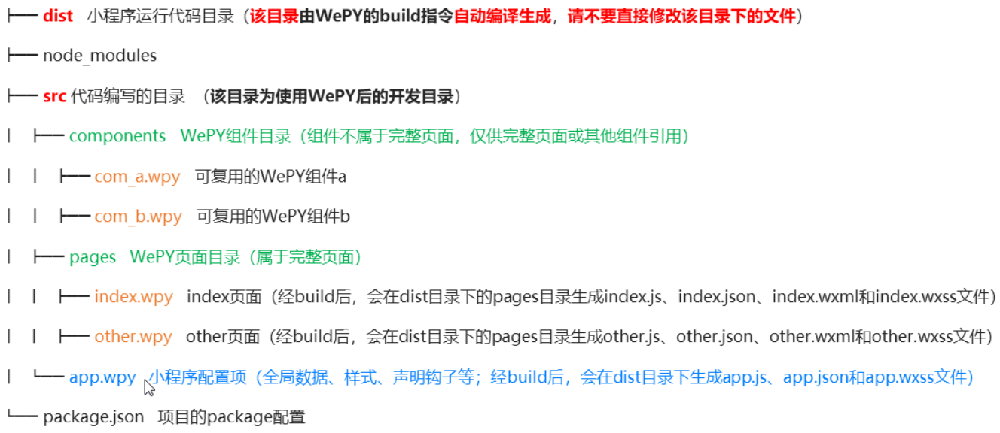

#### day03-小程序基础

#### 课程目标

+ 能够知道如何创建自定义组件和定义数据、方法
+ 能够了解组件的生命周期函数
+ 能够知道小程序中插槽的使用
+ 能够知道小程序中组件通信的几种方式
+ 能够使用wepy创建项目
+ 能够将wepy项目运行起来
+ 能够知道.wpy文件结构的作用
+ 能够知道如何使用wepy绑定事件
+ 能够知道如何利用wepy发送请求

#### 01-自定义组件的基本使用

前端中组件的概念就是：将页面的视图结构进行封装，即构成组件

组件化最大的好处就是前端结构的复用性问题

##### 1.1、小程序组件 -- 创建与引用

###### 001 - 组件的创建

- 在项目的根目录中，鼠标右键，创建 components 文件夹 --> test 
- 在新建的 components -> test 文件夹上，鼠标右键，点击“新建 Component”
- 为新建的组件命名之后，会自动生成组件对应的 4 个文件，后缀名分别为 `.js`，`.json`， `.wxml` 和 `.wxss`

**注意：应当尽量将不同的组件，存放到单独的文件夹中，从而保证清晰的目录结构**

###### 002 - 组件的引用

- 在需要引用组件的页面中，找到页面的 `.json` 配置文件，新增 `usingComponents` 节点
- 在 `usingComponents` 中，通过键值对的形式，注册组件；键为注册的组件名称，值为组件的**相对路径**
- 在页面的 `.wxml` 文件中，把注册的组件名称，以**标签形式在页面上使用**，即可把组件展示到页面上

```javascript
{
  "usingComponents": {
    "custom-test":"../../components/test/test"
  }
}
```

**注册组件名称时，建议把组件名称使用中横线进行连接，例如 vant-button 或 custom-button**

##### 1.2、小程序组件 -- 数据与方法

> [组件详细的参数含义和使用](https://developers.weixin.qq.com/miniprogram/dev/reference/api/Component.html)

###### 001 -  使用 data 定义组件的私有数据

- 小程序组件中的 `data`与小程序页面中的 `data` 用法一致，区别是：
  - 页面的 `data` 定义在 `Page()` 函数中
  - 组件的 `data` 定义在 `Component()` 函数中
- 在组件的 `.js` 文件中：
  - 如果要访问 `data` 中的数据，直接使用 `this.data.数据名称` 即可
  - 如果要为 `data` 中的数据重新赋值，调用 `this.setData({ 数据名称: 新值 })` 即可
- 在组件的 .wxml 文件中
  - 如果要渲染 data 中的数据，直接使用 {{ 数据名称 }} 即可

###### 002 - 使用 methods 定义组件的事件处理函数

> [组件间通信与事件 详细文档](https://developers.weixin.qq.com/miniprogram/dev/framework/custom-component/events.html)

- 和页面不同，组件的事件处理函数，必须定义在 methods 节点中

```javascript
methods: {
  changeName () {
    this.setData({
      count: 0
    })
  }
}
```

##### 1.3、组件的生命周期

> 组件的生命周期，指的是组件自身的一些函数，这些函数在特殊的时间点或遇到一些特殊的框架事件时被自动触发。

- 最重要的生命周期是 `created`, `attached`, `detached` ，包含一个组件实例生命流程的最主要时间点。
  - 组件实例刚刚被创建时， `created` 生命周期被触发。
  - 在组件完全初始化完毕、进入页面节点树后， `attached` 生命周期被触发。
  - 在组件离开页面节点树后， `detached` 生命周期被触发。
- 通过点击按钮切换tets组件案例演示detached
  + 给父组件的按钮注册点击事件

    ```html
    <button bindtap="switchTest">控制test组件显示移除</button>
    ```

  + 定义switchTest事件函数

    ```js
    switchTest () {
      // data中定义flag为一个布尔值
      this.setData({
        flag: !this.data.flag
      })
    }
    ```

  + 将flag给组件绑定上

    ```html
    <my-test wx:if="{{flag}}"></my-test>
    ```

    ​

**其他： [组件生命周期详解](https://developers.weixin.qq.com/miniprogram/dev/framework/custom-component/lifetimes.html)**

##### 1.4、小程序插槽的使用

组件在使用的时候，可以在组件节点中间提供wxml结构，供组件内部去展示

**注意：小程序中目前只有默认插槽和多个插槽，暂不支持作用域插槽。**

###### 001 - 默认插槽

- 插槽使用步骤

  - 组件在使用的时候可以提供wxml结构

    ```javascript
    <custom-test>
      <view>
        <text>我是插槽的结构</text>
      </view>
    </custom-test>
    ```

  - 组件自身内部需要通过slot组件标签来接收传递过来的结构

    ```
    <slot></slot>
    ```

###### 002 - 多个插槽

- 在组件中，需要使用多 `slot` 时，可以在组件 `js` 中声明启用。

  ```js
  Component({
    options: {
      multipleSlots: true
    }
  })
  ```

- 在组件在使用的时候通过slot的名字提供不同的插槽

  ```html
  <!-- 插槽的学习 -->
  <my_test>
    <view slot="header">
      我是插槽头部
    </view>
    <view slot="footer">
      我是插槽底部
    </view>
  </my_test>
  ```

- 组件在内部接受的时候通过name对应插槽的名字来接收

  ```html
  <slot name="header"></slot>
  <view><text>这是test组件</text></view>
  <slot name="footer"></slot>
  ```

#### 02-组件通信的三种方式

- `WXML` 数据绑定：用于父组件向子组件的指定属性传递数据，子组件内部通过properties来接收
- 父组件主动获取子组件的数据：父组件通过 `this.selectComponent` 方法获取子组件实例对象，便可以直接访问组件的任意数据和方法。
- 事件，子组件将数据传递给父组件：用于子组件向父组件传递数据，可以传递任意数据。

##### 2.1、小程序组件 --  properties

properties是用来接收外界传递到组件内部的数据的，类似于 `Vue` 中的 `props`

- 组件的 `properties` 和 `data` 的用法类似，它们都是可读可写的，只不过
  - `data` 更倾向于存储组件的私有数据
  - `properties` 更倾向于存储外界传递到组件中的数据

###### 001 - properties  使用步骤

- 外界通过在组件的标签上，以属性的形式进行传递

  ```html
  <my-prop money="{{money}}"></my-prop>
  ```

- 组件内部通过properties进行接收，并且可以限定类型

  ```js
  properties: {
    money: {				// 属性名
      type: Number,	// 属性的数据类型
      value: 0		// 默认值
    },
    money: Number  // 简化的定义方式
  }
  ```

**注意：**

+ type 的可选值为 Number，String、Boolean、Object、Array、null(表示不限制类型)  

###### 002 - 修改父组件的值

当修改父组件的值的时候，子组件也会同步修改

```javascript
<view>
  父亲的钱：{{money}}
  <button bindtap="addMoney">父亲点击一下就赚10万</button>
</view>
```

```javascript
addMoney () {
  this.setData({
    money: this.data.money+100000
  })
}
```

###### 003 - 组件内修改 properties

> properties 的值是可读可写的，可以通过 `setData` 修改 `properties` 中任何属性的值，但是不会影响父组件的值

案例代码

+ 给子组件按钮注册点击事件

  ```html
  <view>我是子组件</view>
  <button bindtap="addMoney">儿子点一下赚一块钱</button>
  <view>我有{{money}}</view>
  ```


+ 定义事件函数

  ```js
  addMoney () {
    this.setData({
      money: this.data.money+1
    })
  }
  ```

##### 2.2 - 通过事件监听实现子向父传值

事件系统是组件间通信的主要方式之一。

+ 子组件通过triggerEvent触发事件
+ 父组件通过定义自定义事件的事件函数来接收子组件传递过来的值

案例

准备工作

+ 父组件定义一个数据接受值

  ```js
  data: {
    parentMoney:0
  }
  ```

  ```html
  <view>我是父亲，已破产：{{parentMoney}}</view>
  ```


+ 子组件定义一个按钮，当点击按钮的时候给父组件传值

  ```js
  data: {
    money: 10000000
  }
  ```

  ```
  <view>
    我是儿子，我有钱：{{money}}
    <button bindtap="sendMoney">给父亲拨款</button>
  </view>
  ```

实现传值步骤

+ 在子组件内部定义sendData事件函数，并且通过triggerEvent给父组件传值

  ```js
  sendMoney () {
    // 触发一个自定义事件（事件需要在使用组件的标签上），并且发送一个数据
    this.triggerEvent('myEvent',{
      money:this.data.money
    })
  }
  ```

+ 因为要触发myEvent这个事件，所以在使用组件的位置，绑定自定义事件

  ```
  <my-event bind:myEvent="getMoney"></my-event>
  ```

+ 在父组件定义getData事件函数，并且通过事件对象获取传递过来的数据

  ```js
  getMoney (e) {
    console.log(e.detail.money)
    this.setData({
      parentMoney: e.detail.money
    })
  }
  ```


##### 2.3 通过selectComponent获取子组件数据

父组件的 `.js` 文件中，可以调用 `this.selectComponent(string)` 函数并指定 `id` 或 `class` 选择器， 获取子组件对象 ，既然获取到子组件再通过.data即可获取到子组件的数据

注意：获取子组件不能使用标签选择器，否则返回null

- 给按钮注册点击事件，点击获取子组件的值，在使用子组件的标签上添加类名或id名

  ```html
  <view>我是父亲，已破产：{{parentMoney}}</view>
  // 给按钮注册点击事件，点击获取子组件的值
  <button bindtap="getChildData">找儿子要钱</button>
  <view>--------父子分割线--------</view>
  <my-select id="my_select"></my-select>
  ```


- 父组件的事件函数内部可以通过this.selectComponent(选择器)获取到子组件

  ```js
  getChildData () {
    console.log(this.selectComponent('#my_select').data.money)
    this.setData({
      parentMoney: this.selectComponent('#my_select').data.money
    })
  }
  ```

#### 03 -  wepy的使用

##### 3.1、WePY 简介和安装

###### 001 - 什么是 `WePY`

> `WePY` 是腾讯官方出品的一个小程序快速开发框架，对原生小程序的开发模式进行了再次封装

[wepy官网](https://tencent.github.io/wepy/donate.html)

###### 002 - 为什么使用 `WePY`

> `WePY` 相比于原生小程序开发，拥有众多的开发特性和优化方案，

- 开发风格接近于 Vue.js，支持很多vue中的语法特性；
- 通过 polyfill 让小程序完美支持 Promise；
- 可以使用ES6等诸多高级语法特性，简化代码，提高开发效率；
- 对小程序本身的性能做出了进一步的优化；
- 支持第三方的 npm 资源；
- 支持多种插件处理和编译器；

###### 003 - 安装 `WePY`

- `WePY` 的安装或更新都通过 `npm` 、yarn、cnpm进行全局安装

```
npm install wepy-cli -g
```

###### 004 - 初始化 `WePY` 项目

- 使用命令行方式进行初始化项目结构
  + ```wepy init standard myproject```
  + `wepy init`  -- 是固定写法，代表要初始化 `wepy` 项目；
  + `standard`  -- 代表模板类型为标准小程序模板
  + `myproject`  -- 为自定义的项目名称。


- Project name () ：项目的名字可以更改，如果不修改直接回车即可
- AppId (touristappid)：输入自己小程序的Appid
- Project description：项目的描述，直接回车即可
- Author (lfs)：项目作者，直接回车
- Use ESLint to lint your code? (Y/n)：真正开发的时候建议开启，现在学习阶段，先不开启
- Use Redux in your project?：是否使用Redux框架语法,目录会多出store目录，no
- Use web transform feature in your project?：是否开启web转换，no

###### 005- `WePY` 和 小程序项目的关系

- 通过 `wepy init` 命令初始化的`wepy` 项目，实际是一个模板项目，不能直接当作小程序运行。
- 需要运行相关的命令，把模板项目编译为小程序项目，才可以运行。


------


#### 04 - wepy项目介绍

##### 4.1 - wepy项目运行

###### 001 - 运行编译 `WePY` 项目

- 运行 `cd myproject` 切换至 `WePY`` 项目根目录
- 运行 `npm install` 安装 `WePY` 项目依赖项
- 运行 `wepy build --watch` 开启实时编译
  - `wepy build --watch` 命令，会循环监听 `WePY `项目中源代码的变化，自动编译生成小程序项目

**注意：生成的小程序项目默认被存放于 dist 目录中。**

###### 002 - 认识`WePY` 项目目录



###### 003 - 将 `WePy` 项目导入到开发者工具中

- 在微信开发者工具中选择导入项目，选择项目的根目录即可
- 可以用vscode打开wepy项目

##### 4.2、`WePY` 文件介绍

###### 001 - 介绍`.wpy`文件的组成部分

- 一个 .wpy 文件可分为三大部分，各自对应于一个标签：
  - 脚本部分，即 `<script></script>` 标签中的内容，又可分为两个部分：
    - 逻辑部分，除了 `config` 对象之外的部分，对应于原生的 `.js` 文件
    - 配置部分，即 `config` 对象，对应于原生的 `.json` 文件
  - 结构部分，即 `<template></template>` 模板部分，对应于原生的 `.wxml` 文件。
  - 样式部分，即`<style></style>`样式部分，对应于原生的 `.wxss` 文件。
- 其中，小程序入口文件 `app.wpy` 不需要 `template`，所以编译时会被忽略。

###### 002- 小程序入口 `app.wpy`

app.wpy主要分为两大部分script和style

- `config` 属性会被编译为小程序的 `app.json` 全局配置文件；
- `config` 属性之外的其它节点，会被编译为小程序的 `app.js` 文件；
- style 标签会被编译为小程序的 `app.wxss` 全局样式；

###### 003 - `app.wpy` 全局配置小程序外观

> 在小程序的入口文件中找到 window 节点：`app.wpy` -> `script`标签 -> `config` -> `window` 即可全局配置小程序的外观

```javascript
window: {
  backgroundTextStyle: 'dark',
  navigationBarBackgroundColor: '#fff',
  navigationBarTitleText: '小程序电商项目',
  navigationBarTextStyle: 'black'
}
```

###### 004 - 页面 `.wpy` 文件中 `script` 标签组成结构

> 页面文件 `page.wpy` 中所声明的页面实例继承自 `wepy.page` 类

| 属性         |                    说明                    |
| :--------- | :--------------------------------------: |
| config     | 页面配置对象，对应于原生的`page.json`文件，类似于`app.wpy`中的config |
| components |          页面组件列表对象，声明页面所引入的组件列表           |
| data       |        页面渲染数据对象，存放可用于页面模板绑定的渲染数据         |
| methods    | wxml事件处理函数对象，存放响应wxml中所捕获到的事件的函数，如`bindtap`、`bindchange` |
| computed   |              和vue的计算属性是一样的               |
| onLoad     |               小程序页面生命周期函数                |

###### 005 - 尝试修改window窗口外观

+ 通过修改app.wpy里面的config》window来配置窗口外观


#### 05-wepy的基本使用

##### 5.1创建页面和事件绑定

**如何设置默认首页**

+ 在pages文件夹下面新建home.wpy文件

+ 定义基本的结构

  ```html
  <template>

  </template>

  <script>

  import wepy from 'wepy'

  export default class Home extends wepy.page {
    data = {
    }

    config = {
    }

    methods = {

    }
  }

  </script>

  <style lang='less'>

  </style>
  ```

+ 配置用户代码片段，文件》首先项》用户代码片段》新建全局用户代码片段，取名wepy回车创建，将代码片段复制进文件内部即可

+ 将home.wpy路劲配置到全局的app.wpy下面的pages里面，并且是第一个

**页面绑定事件以及传参**

在 `wepy` 框架中，优化了事件绑定机制，支持类似于 `Vue.js `的事件绑定语法

- 在 `WePY` 中，统一使用 `@` 绑定事件，传递参数直接采用`@tap='handle({{params}})'`传递
- 案例代码

```html
<button type="primary" size="mini" @tap="tapHandle({{count}},{{count2}})">点我啊，老弟</button>
```

```javascript
data = {
  msg: '锄禾日当午，汗滴禾下土，这是四个人',
  count:10,
  count2:20
}

config = {
}

methods = {
  tapHandle (num,num2) {
    console.log(num,num2)
  }
}
```

+ 如果想获取到事件对象，默认不传递参数，第一个形参为事件对象
+ 如果即想要传参还想要获取到事件对象，可以采取data-自定义属性的形式传参

**页面绑定事件关于事件函数和非事件函数的注意事项**

+ 事件函数我们定义在methods里面
+ 非事件函数我们推荐定义在methods同级的下面

#####5.2文本框和数据绑定同步

- 案例逻辑：

  - 首先在data里面准备数据，并渲染到input输入框中

    ```javascript
    data = {
      count: 10,
      value: '我和陆游说，我比较喜欢李白的诗，陆游气坏了，然后我家没网了'
    }

    <input type="text" value="{{value}}">
    ```

  - 给输入框注册input事件监听输入框的变化

    ```javascript
    <input type="text" value="{{value}}" @input="inputHandle">
    ```

  - 在事件处理函数内部拿到最新的输入框的值，并同步给数据

    ```javascript
    methods = {
      inputHandle (e) {
        console.log(e.detail.value)
        this.value = e.detail.value
      }
    }
    ```

#### 06 - wepy的request请求

##### 6.1wepy发送请求

`WePY` 框架对原生小程序做了封装，之前通过 `wx` 调用的 `API`，都可以直接使用 `wepy` 进行调用

+ 利用wepy调用原生的方法

  ```js
  wepy.request({
    url: 'https://www.liulongbin.top:8082/api/get',
    success(res){
      console.log(res)
    }
  })
  ```

+ 修改成基于promise的形式，结果发现报错不支持

  ```js
  wepy.request({
    url: 'https://www.liulongbin.top:8082/api/get'
  }).then(res=>{
    console.log(res)
  })
  ```

**配置 `promisify` 启用 `async` 和 `await`**

- 默认使用 `wepy-cli` 创建的项目，不支持使用 `ES7` 的 `async` 和 `await` 来简化 `Promise API` 的调用。

- 需要手动开启此功能：打开 `src` -> `app.wpy`，找到 `constructor()` 构造函数，在构造函数中代码的最后一行，添加 `this.use(‘promisify’)`

  ```js
  constructor () {
    super()
    this.use('requestfix')
    this.use('promisify')
  }
  ```

- 基于promise使用wepy发送get请求

  ```js
  // wepy 发送 Get 请求

  wepy.request({
    url: 'https://www.liulongbin.top:8082/api/get',
    data:{
      age: 18
    }
  }).then(res=>{
    console.log(res)
  })
  ```

- 利用async和await简化promise

  ```js
  async getData () {
    const res = await wepy.request({
      url: 'https://www.liulongbin.top:8082/api/get',
      data:{
        age: 18
      }
    })
    console.log(res)
  }
  ```

##### 6.2异步更新数据

在异步函数中更新数据的时候，必须手动调用 this.$apply 方法。

```js
const res = await wepy.request({
  url: 'https://www.liulongbin.top:8082/api/get',
  data:{
    age: 18
  }
})
console.log(res)
this.value = res.data.data.age
this.$apply()
```

#####6.2发送post请求

```js
async postData () {
  const res = await wepy.request({
    url: 'https://www.liulongbin.top:8082/api/post',
    method: 'post',
    data:{
      age: 18
    }
  })
  console.log(res)
}
```
