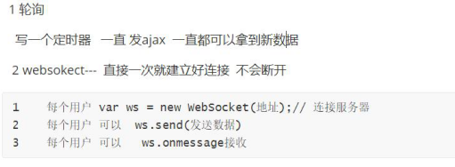
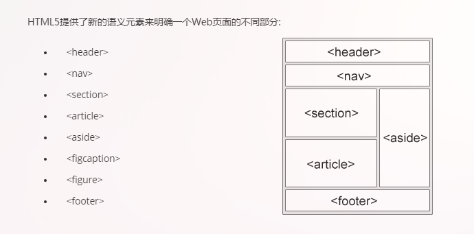
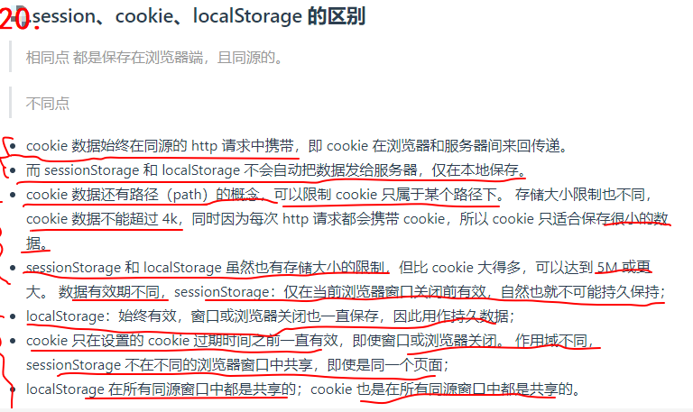
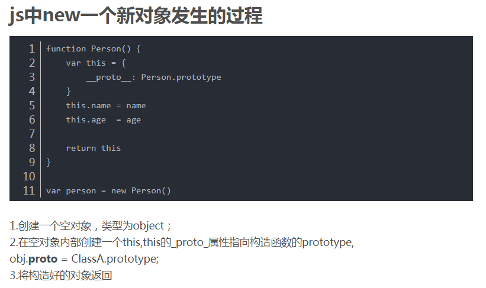
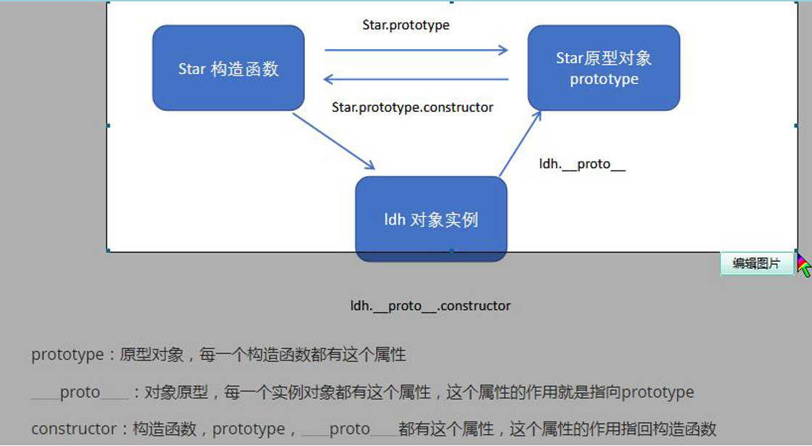
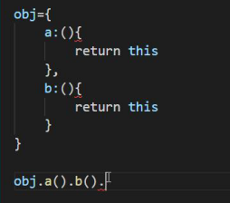
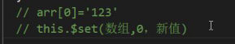

# 参考

https://segmentfault.com/a/1190000016344599

https://github.com/evestorm/front-end-interview

https://www.jianshu.com/p/42a4be57287f?utm_campaign

https://blog.csdn.net/weixin_41819098/article/details/88970828

https://segmentfault.com/a/1190000016481101

缓存：
  1 浏览器缓存
     浏览器默认是会有缓存的 
        分别是强制缓存和协商缓存
          强缓存：不会向服务器发送请求，直接从缓存中读取资源
           强缓存可以通过设置两种 HTTP Header 实现：Expires过期时间 和 Cache-Control缓存控制。
           Cache-Control:max-age=300  缓存300秒

    强制缓存优先于协商缓存进行，
  若强制缓存(Expires和Cache-Control)生效则直接使用缓存，
 若不生效则进行协商缓存(Last-Modified / If-Modified-Since和Etag / If-None-Match)，
 协商缓存由服务器决定是否使用缓存，若协商缓存失效，
 那么代表该请求的缓存失效，返回200，重新返回资源和缓存标识，
  再存入浏览器缓存中；生效则返回304，继续使用缓存


  2 服务器缓存
​      服务器 可以 主动把 需要缓存的数据或者页面内容 存到 redis(类似数据库 比数据库快) 中 
​          后面可以从里面取  就不去数据库拿了

  3 html5 有个manifest 也可以缓存 但是不常用

页面优化：
   1 使用 精灵图 或者字体图标 
   2 压缩代码
   3 把一些大的css js文件放在cdn 服务器  从cdn服务器去引入
   4 图片懒加载
   5 把图片或者视频 放在其他服务器 比如七牛服务器 等等 
   6 使用缓存(一定要答出来)


设计模式：
订阅者
发布者
观察者


# HTML CSS


## 即时通讯



## http缓存策略

localstorage 能做到数据的持久化本地储存，除非主动删除，否则不会消失

sessionStorage 是本地储存一个会话中的数据，会话关闭，则数据销毁，不能做到数据的持久化

cooki


## html5 新特性 css3新特性

### HTML5

#### 1 新标签

+ saide	定义页面侧边栏的内容区域
+ header
+ footer
+ nav    定义导航链接部分
+ section    定义文档的 
+ article  定义页面独立的内容区域
+ mark  定义带有几号的文本
+ 

#### 2 canvas

Canvas元素用于图形的绘制，通过脚本来完成

#### 3 拖放

任何元素都可以拖放

``` html

```

 拖动什么 - ondragstart 和 setData() 

 放到何处 - ondragover

进行放置 - ondrop 

#### 4 地理定位

#### 5 音频、视频

``` html
<audio controls>
<source src="horse.ogg" type="audio/ogg">
<source src="horse.mp3" type="audio/mpeg">
您的浏览器不支持 audio 元素。
</audio>
```

``` html
<video width="320" height="240" controls>
<source src="movie.mp4" type="video/mp4">
<source src="movie.ogg" type="video/ogg">
您的浏览器不支持Video标签。
</video>
```

#### 6 input类型

#### 7 表单新元素和属性


### css3新特性

#### 1. css3选择器

+ .class
+ #id
+ div
+ p + span
+ div p 后代选择器
+ div>p 子代选择器
+ *通配符
+ 【target】 属性选择器

#### 2. css3边框

+ 圆角
+ 阴影
+ 背景
+ 多背景
+ 渐变
+ 文本效果
+ 转化和变形
+ 过渡
+ 动画
+ flex
+ 多媒体查询


## Flex布局

+ flex-direction 设置主轴方向
+ flex-wrap 设置是否换行
+ justify-content 主轴方向上水平
+ align-items 单行垂直方向居中
+ align-content 多行垂直方向居中


# JS


## 继承的方法

### call apply

### prototype方法

``` js
a.prototype = new Abc()
a.prototype.cunstrcter = a
Abc()
```


## 数组的方法

- join()
- push()和pop()
- shift() 和 unshift()
- sort()
- reverse()
- concat()
- slice()
- splice()
- indexOf()和 lastIndexOf() （ES5新增）
- forEach() （ES5新增）
- map() （ES5新增）
- filter() （ES5新增）
- every() （ES5新增）
- some() （ES5新增）

1. join（）数组转化成字符串 ， 也可以改变里面连接的符号

   ``` js
   var arr = [1,2,3];
   console.log(arr.join()); 　　　　// 1,2,3
   console.log(arr.join("-")); 　　// 1-2-3
   console.log(arr); 　　　　　　　　// [1, 2, 3]（原数组不变）
   ```

   

2. forEach()方法 遍历循环   function（item，index）

3. push 最后添加

4. pop最后删除

5. shift 前面删除

6. unshift 前面添加

7. sort（） 数组里的项从小大排序

8. reverse() 反转字符传

9. concat（） 数组拼接

10. **slice()**  指定下标开始到结束组成新数组

11. splice() 删除 添加 插入

12. indexOf() 查找下标

13. filter（） 过滤

    ``` js
    var arr = [1, 2, 3, 4, 5, 6, 7, 8, 9, 10];
    var arr2 = arr.filter(function(x, index) {
    return index % 3 === 0 || x >= 8;
    }); 
    console.log(arr2); 　　　　　　　　//[1, 4, 7, 8, 9, 10]
    ```

    

14. map()  对数组每一项进行函数处理

    ``` js
    var arr = [1, 2, 3, 4, 5];
    var arr2 = arr.map(function(item){
    return item*item;
    });
    console.log(arr2); 　　　　　　　　//[1, 4, 9, 16, 25]
    ```

    

15. every() 审查每一项是否符合条件 返回布尔值

16. some() 只要有一项符合条件就返回 true


### 数组去重的方法

```js
var arr1 = [1,1,2,3]
    quchong = (arr) => {
        // return arr.filter((item,index) => {
        //     return arr.indexOf(item) === index
        // })
        var newArr = []

        for (let i = 0; i < arr.length; i++) {
            if (newArr.indexOf(arr[i]) == -1) {
                newArr.push(arr[i])
            }
            
        }
        return newArr
    }
    console.log(quchong(arr1));
```


## es6 new Set() new Map()

``` js
    arr = [1, 2, 3, 4, 5, 6, 6, 7, 7]

    // new Set（）去重
    var set = new Set(arr)
    set.add(8)
    set.delete(1)
    console.log([...set]); // 解构的方法将伪数组转化成数组

    // new Map 是一组键值对的结构，具有极快的查找速度
    arr2 = [
        ["张三", 85],
        ["李四", 90]
    ]
    var map = new Map(arr2)
    map.set("王五", 95)
    map.set("王五" , 99)
    map.delete("王五")
    console.log(map);
```


## 对象的方法

1. ###  **Object.assign()** 

+ 一个或多个源对象复制到目标对象

``` js

const target = { a: 1, b: 2 };
const source = { b: 4, c: 5 };
const returnedTarget = Object.assign(target, source);
console.log(target);
// expected output: Object { a: 1, b: 4, c: 5 }
console.log(returnedTarget);
```


2. ### **Object.create()**

+ 创建一个新对象，使用现有的对象来提供新创建的对象的__proto__。

  ``` js
  
  const person = {
    isHuman: false,
    printIntroduction: function () {
      console.log(`My name is ${this.name}. Am I human? ${this.isHuman}`);
    }
  };
   
  const me = Object.create(person);
   
  me.name = "Matthew"; // "name" is a property set on "me", but not on "person"
  me.isHuman = true; // inherited properties can be overwritten
   
  me.printIntroduction();
  ```

  

### 3. **Object.keys()**

``` js
var arr = ['a', 'b', 'c'];
console.log(Object.keys(arr)); // console: ['0', '1', '2']
```


## 改变this指向

+ call
+ apply
+ bind

``` js
var name = "123"
var obj = { name: '456'}
funcion fn() {
    log(this.name)
}
fn() // 123
fn.call(obj) // name: 456
```

区别：

​	apply 和 bind 传参数的格式为数组 ， bind 函数不会立即执行

## 原生操作css

``` js
// 获取DOM节点
var a = document.getElementById("")
a.style.color = "red"


// 用attribute
a.setAttribute('style','')
```


## 闭包


+ *闭包*就是能够读取其他函数内部变量的函数。
+ 闭包的关键在于：外部函数调用之后其变量对象本应该被销毁，但闭包的存在使我们仍然可以访问外部函数的变量对象


## session  cooikes  lcaostorage



##  new 一个新对象 的过程




## 原型链




## 链式编程




## 深浅拷贝

### 浅拷贝

栈基本数据类型，堆引用数据类型

es6扩展运算符，newObj = {...obj}

### 深拷贝


## ES6

### es6新特性

1. let const 
2. 模板字符串
3. 箭头函数
4. 对象数组的解构
5. 类
6. 展开运算符

###  数组函数

### [forEach()、map()、filter()、find()、every()、some()、reduce()]( https://blog.csdn.net/decizi6266/article/details/101263379 )


# jQuey


# Ajax

## 原生JS中的Ajax

``` js
//第一步，创建XMLHttpRequest对象
var xmlHttp = new XMLHttpRequest();
function CommentAll() {
    //第二步，注册回调函数
    xmlHttp.onreadystatechange =callback1;
    //{
    //    if (xmlHttp.readyState == 4)
    //        if (xmlHttp.status == 200) {
    //            var responseText = xmlHttp.responseText;

    //        }
    //}
    //第三步，配置请求信息，open(),get
    //get请求下参数加在url后，.ashx?methodName = GetAllComment&str1=str1&str2=str2
    xmlHttp.open("post", "/ashx/myzhuye/Detail.ashx?methodName=GetAllComment", true);

    //post请求下需要配置请求头信息
    //xmlHttp.setRequestHeader("Content-Type", "application/x-www-form-urlencoded");

    //第四步，发送请求,post请求下，要传递的参数放这
    xmlHttp.send("methodName = GetAllComment&str1=str1&str2=str2");//"

}
//第五步，创建回调函数
function callback1() {
    if (xmlHttp.readyState == 4)
        if (xmlHttp.status == 200) {
            //取得返回的数据
            var data = xmlHttp.responseText;
            //json字符串转为json格式
            data = eval(data);
            $.each(data,
                function(i, v) {
                    alert(v);
                });       
        }
}
```


# Promise

``` js

new Promise(resolve => {
            setTimeout(() => {
                resolve('hello')
            }, 2000)
        }).then(res => {
            console.log(res)
        })
```


# ES6 新特性

- 类
- 模块化
- 箭头函数
- 函数参数默认值
- 模板字符串
- 解构赋值
- 延展操作符
- 对象属性简写
- Promise
- Let与Const

# Vue

[https://juejin.im/post/5d59f2a451882549be53b170#heading-28]

## vue首屏加载过慢如何解决？

- 路由懒加载，会将原来打包一个app.js的文件打包成多个文件 ,异步组件，按需加载
- webpack开启gzip压缩
- 如果图片过多，开启图片懒加载
- 使用cdn资源
- 如果首页是登录页，做多入口

## Vue项目中token

1. 用户通过账户名和密码发送登录请求
2. 服务端对账户的有效性进行验证
3. 验证成功后再利用「密钥」和「加密算法」（如：HMAC-SHA256）对「用户数据」（如账号信息）做一个签名的 token 返回给客户端
4. 客户端本地存储 token ，并在每次请求的 header 中带上 token
5. 服务端验证 token 并返回数据

## spa单页面的优缺点

#### 优点：

1.体验好，不刷新，减少 请求  数据ajax异步获取 页面流程；

2.前后端分离

3.减轻服务端压力

4.共用一套后端程序代码，设配多端


#### 缺点：

1.首屏加载过慢；

2.SEO 不利于搜索引擎抓取


1 解决方法：路由图片、懒加载、js按需加载、使用cdn、js放在body后边、压缩代码、移除console 、debugger;

​                   异步组件（const  aa=resolve =>require(['../xxx/xx']),resolve）

　　　　　修改webpack配置 、添加登录专用的router配置   


2解决办法：VUE  SSR  只是解决SEO问题；

## 讲一下 Vue 的生命周期？

创建期间的生命周期函数：

- beforeCreate：实例刚在内存中被创建出来，此时，还没有初始化好 data 和 methods 属性
- created：实例已经在内存中创建OK，此时 data 和 methods 已经创建OK，此时还没有开始 编译模板
- beforeMount：此时已经完成了模板的编译，但是还没有挂载到页面中。
  - 换句话说，此时页面中的类似 {{msg}} 这样的语法还没有被替换成真正的数据。
- mounted：此时，已经将编译好的模板，挂载到了页面指定的容器中显示【可以获取 DOM 节点 | 发起异步请求】
  - 用户已经可以看到渲染好的页面了

运行期间的生命周期函数：

- beforeUpdate：状态更新之前执行此函数， 此时 data 中的状态值是最新的，但是界面上显示的 数据还是旧的，因为此时还没有开始重新渲染DOM节点
- updated：实例更新完毕之后调用此函数，此时 data 中的状态值 和 界面上显示的数据，都已经完成了更新，界面已经被重新渲染好了！

销毁期间的生命周期函数：

- beforeDestroy：实例销毁之前调用。在这一步，实例仍然完全可用。
- destroyed：Vue 实例销毁后调用。调用后，Vue 实例指示的所有东西都会解绑定，所有的事件监听器会被移除，所有的子实例也会被销毁。

## watch 和 computed 区别

- watch 是监听动作( data中数据的变化 )，computed 是计算属性（插值表达式中的逻辑）
- watch 没缓存，只要数据变化就执行。computed 有缓存，只在属性变化的时候才去计算。
- watch 可以执行异步操作，而 computed 不能
- watch 常用于一个数据影响多个数据，computed 则常用于多个数据影响一个数据

### watch深度监听

``` js
new Vue({
  el: '#root',
  data: {
    obj: {
      a: 123
    }
  },
  watch: {
    obj: {
      handler(newVal, oldVal) {
         console.log('obj.a changed');
      },
      deep: true
    }
  } 
})
```


## Vue.set

Vue.set( target, key, value )
target：要更改的数据源(可以是对象或者数组)
key：要更改的具体数据
value ：重新赋的值

## Vue实现数据双向绑定的原理

+ vue实现数据双向绑定主要是：采**用数据劫持结合发布者-订阅者模式**的方式
+ 通过`Object.defineProperty（）`来劫持各个属性的setter，getter，在数据变动时发布消息给订阅者，触发相应监听回调。
+ 当把一个普通 Javascript 对象传给 Vue 实例来作为它的 data 选项时，Vue 将遍历它的属性，用 Object.defineProperty 将它们转为 getter/setter。
+ 用户看不到 getter/setter，但是在内部它们让 Vue 追踪依赖，在属性被访问和修改时通知变化。

步骤：

1. 第一步：需要 Observe 的数据对象进行递归遍历，包括子属性对象的属性，都加上 setter 和 getter。这样的话，给这个对象的某个值赋值，就会触发 setter，那么就能监听到了数据变化。
2. 第二步：Compile 解析模板指令，将模板中的变量替换成数据，然后初始化渲染页面视图，并将每个指令对应的节点绑定更新函数，添加监听数据的订阅者，一旦数据有变动，收到通知，更新数据。
3. 第三步：Watcher 订阅者是 Observer 和 Compile 之间通信的桥梁，主要做的事情有：
   1. 在自身实例化时往属性订阅器（dep）里面添加自己。
   2. 自身必须有一个 update() 方法
   3. 待属性变动 `dep.notice()` 通知时，能调用自身的 `update()` 方法，并触发 Compile 中绑定的回调，则功成身退。
4. 第四步：MVVM 作为数据绑定的入口，整合 Observer、Compile 和 Watcher 三者，通过 Observer 来监听自己的 model 数据变化，通过 Compile 来解析编译模板指令，最终利用 Watcher 搭起 Observer 和 Compile 之间的桥梁，达到数据变化 -> 视图更新；视图交互变化（input） -> 数据 model 变更的双向绑定效果。


## 数据劫持

Vue中数据更新了，但是视图没有改变是什么情况？

+ 数组和对象可能就不行，需要是用this.$set()




## Object.defineProperty 缺陷？ Vue3.0 采用了 Proxy

1. Vue 中使用 Object.defineProperty 进行双向数据绑定时，告知使用者是可以监听数组的，但是只是监听了数组的 push()、pop()、shift()、unshift()、splice()、sort()、reverse() 这八种方法，其他数组的属性检测不到。
2. Object.defineProperty 无法监控到数组**下标**的变化，导致通过数组下标添加元素，不能实时响应；
3. Object.defineProperty 只能劫持对象的属性，因此对每个对象的属性进行遍历时，如果属性值也是对象需要深度遍历，那么就比较麻烦了，所以在比较 Proxy 能完整劫持对象的对比下，选择 Proxy。
4. Proxy 不仅可以代理对象，还可以代理数组。还可以代理动态增加的属性。


## Vue中传值

### 父传子

父组件中

在子组件标签中，写一个属性 ：自定义属性名=‘要传的值的名字’

子组件中

用 prop=["父组件中自定义属性名"]


### 子传父

子组件

子组件函数写 this.$emit( '函数名',要传的值 )

父组件

在子组件标签上的属性 @子组件定义的函数名 = "函数名" ， 在父组件中新定义的这个函数的参数就可以接受到子组件的值


### evenBus

这个在小型项目中使用，了解原理

- new Vue  （） 实例 ， 然后引入， improt evenBus from 'new vue 文件路径'
- evenBus.$emit （）， 将事件，或者 值 抛出 ，执行 
- evenBus.$on（） ， 将这个事件注册


### Vuex

this.$store.commit() 这个是调用 mutation 中的函数

this.$store.dispatch() 这个是调用 action中函数


### 在父级中给子组件绑定一个原生click事件，这个事件会被触发吗？

+ 不能，绑定的该click事件会被当做组件上的一个普通属性看待
+ 可以使用 `@click.native='change'` 的方式来实现。


## 	在列表组件中添加 key 属性的作用？

+ **key的主要作用就是在更新组件时判断两个节点是否相同。相同就复用，不相同就删除旧的创建新的。**
+ **这样可以更高效的更新虚拟 DOM。**


# 小程序


# git


1 初始化本地仓库: 
   git init 
2 从远程仓库拉取初始代码:
   git clone 远程仓库地址  远程仓库分支名 
   git pull 远程仓库地址 远程仓库分支名 
3 本地仓库记录首次项目内容:
   git  add  *
   git  commit  -m  "当前操作描述"
3 准备开始完成功能A,创建A分支并切换到A分支上
   git  checkout  -b  A功能分支名
4 完成了A功能之后进行本地仓库版本记录
  git add *
  git  commit -m "A功能完成描述"
5 切换回本地仓库主分支,并合并A分支
  git checkout master
  git merge A功能分支名
  git add *
  git commit -m "A功能完成记录"
6 提交到远程仓库,要先从远程仓库拉取防止销毁别人的代码,然后提交
  git pull 远程仓库地址  远程仓库分支名
  git add * 
  git commit -m "拉取代码记录"
  git push -u  远程仓库地址  远程仓库分支名
其他常见命令:
git log  查看本地项目中所有版本信息
git status  检查本地仓库内容是否有未跟踪的内容
git reset 版本号  回退到制定版本号


# npm

``` bash
# 淘宝镜像
npm install -g cnpm --registry=https://registry.npm.taobao.or
# 全局安装
npm install express -g   
# 查看全局安装的模块
npm list -g
# 下载模块
npm uninstall express
```


# 网站前端优化

1. 减少HTTP请求
2. 使用CDN 
   1. 简单理解就是，一组分布在多个不同地理位置的Web服务器，因为距离用户近，HTTP请求的响应时间缩短
3. 添加Expires头
   1. 页面初次访问者会进行很多HTTP请求，但是通过使用一个长久=的EXpires头，可以是这些组件被缓存，下次访问的时候，可以减少不必要的HTTP请求，从而提高加载速度
4. 压缩组件
5. 将样式表放在头部
6. 将脚本放在底部
7. 避免css表达式
8. 使用外部的css和js，这样浏览器可以缓存
9. 减少DNS查找
10. 精简js css   避免重定向
11. 使Ajax可缓存


## 移动端优化

  1、首屏加载和按需加载，懒加载
  2、资源预加载
  3、图片压缩处理，使用base64内嵌图片
  4、合理缓存dom对象
  5、使用touchstart代替click（click 300毫秒的延迟）
  6、利用transform:translateZ(0)，开启硬件GUP加速
  7、不滥用web字体，不滥用float（布局计算消耗性能），减少font-size声明
  8、使用viewport固定屏幕渲染，加速页面渲染内容
  9、尽量使用事件代理，避免直接事件绑定


# 浏览器输入地址回车发生了什么

+ 域名解析 --> 
+ 发起TCP的3次握手 --> 
+ 建立TCP连接后发起http请求 --> 
+ 服务器响应http请求，浏览器得到html代码 -->
+  浏览器解析html代码，并请求html代码中的资源（如js、css、图片等） -->
+  浏览器对页面进行渲染呈现给用


# Vue  和 react  有什么区别

1. react数据是单向流，Vue数据和视图双向绑定，redux-form可以做到
2. react HTML css js 都在一起写，设计了JSX，Vue是组合在一个页面，用各自的处理方式
3. React什么功能内置，交给什么社区去做


# 题目

+ 自我介绍

+ 为什么离职

+ 做过那些项目

+ 开发遇到哪儿些困难，如何解决的

+ 你收获了什么你

+ 你是不是培训过

+ 什么是vue ssr  服务端渲染

+ vue react 区别

+ 你用过预编译语言吗？

+ 你编写的移动端app是什么移动端  混合开发

+ 堆和栈

+ 异常是怎么处理的

+ c3 h5

+ jq源码看过吗

+ 钩子函数

+ 路由的生命周期

+ 小程序写过吗 与VUE的区别

+ v-for 中key的作用

+ jsonp的原理

+ 大学上过什么课程

+ ssr  和 csr 

